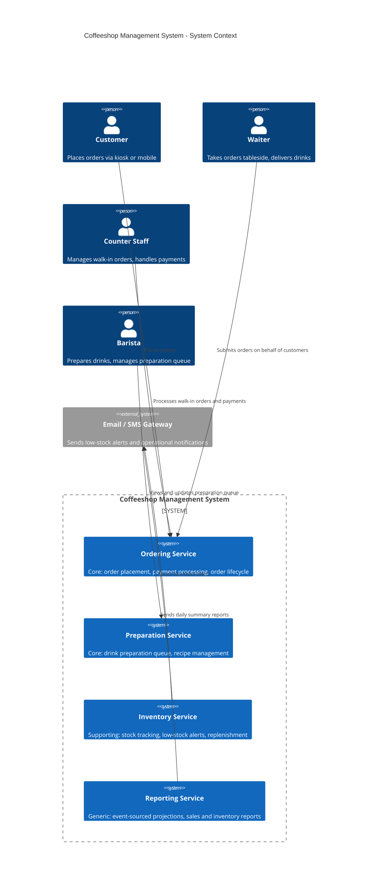

# Context Viewpoint

## System Scope

The Coffeeshop Management System handles the end-to-end lifecycle of coffee orders: from placement by customers or staff, through preparation by baristas, to delivery and completion. It also manages ingredient inventory with automated low-stock alerts and provides operational reporting for business insights.

The system is deployed to AWS (ap-east-2, Taipei) and serves a single-location coffeeshop with potential for multi-location expansion.

## Context Diagram

## Actors

| Actor | Role | Primary Interactions |
|-------|------|---------------------|
| Customer | End consumer | Places orders via kiosk SPA or mobile browser |
| Waiter | Floor staff | Takes tableside orders, marks orders as delivered |
| Counter Staff | Front-of-house | Manages walk-in orders, processes payments |
| Barista | Preparation staff | Works through preparation queue, marks items ready |

## External Systems

| System | Purpose | Integration |
|--------|---------|-------------|
| Email / SMS Gateway | Operational alerts | Inventory low-stock warnings, daily report summaries |
