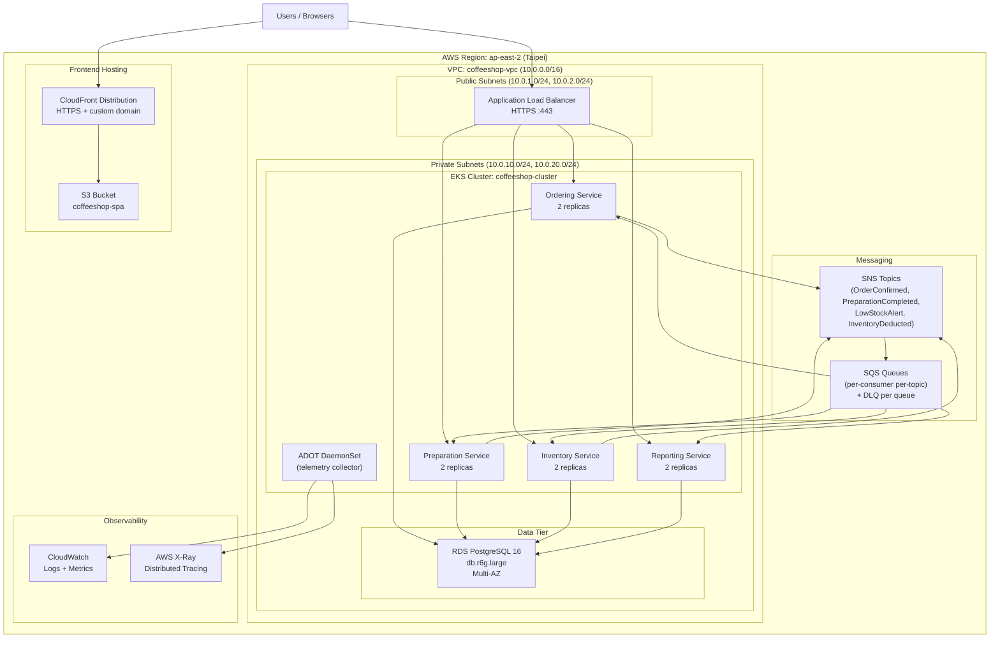

# Deployment Viewpoint

## Overview

The Coffeeshop Management System is deployed to AWS region `ap-east-2` (Taipei). The backend services run on Amazon EKS, the frontend SPA is served from S3 + CloudFront, and the data tier uses a single RDS PostgreSQL instance with schema-per-bounded-context isolation.

## Deployment Topology



## Network Architecture

| Subnet Type | CIDR | Resources |
|-------------|------|-----------|
| Public (AZ-a) | 10.0.1.0/24 | ALB, NAT Gateway |
| Public (AZ-b) | 10.0.2.0/24 | ALB (multi-AZ) |
| Private (AZ-a) | 10.0.10.0/24 | EKS worker nodes, RDS primary |
| Private (AZ-b) | 10.0.20.0/24 | EKS worker nodes, RDS standby |

## EKS Cluster Configuration

| Parameter | Value |
|-----------|-------|
| Kubernetes version | 1.29 |
| Node group instance type | m6i.large |
| Min nodes | 2 |
| Max nodes | 6 |
| Node group AMI | Amazon Linux 2023 (EKS optimized) |

## Service Pod Configuration

| Service | Replicas | CPU Request | Memory Request | CPU Limit | Memory Limit |
|---------|----------|-------------|----------------|-----------|--------------|
| Ordering | 2 | 250m | 512Mi | 500m | 1Gi |
| Preparation | 2 | 250m | 512Mi | 500m | 1Gi |
| Inventory | 2 | 200m | 384Mi | 400m | 768Mi |
| Reporting | 2 | 200m | 384Mi | 400m | 768Mi |
| ADOT (DaemonSet) | 1 per node | 100m | 128Mi | 200m | 256Mi |

## RDS Configuration

| Parameter | Value |
|-----------|-------|
| Engine | PostgreSQL 16 |
| Instance class | db.r6g.large |
| Storage | 100 GB gp3 |
| Multi-AZ | Yes |
| Backup retention | 7 days |
| Maintenance window | Sun 03:00-04:00 UTC+8 |
| Schemas | `ordering`, `preparation`, `inventory`, `reporting` |

## S3 + CloudFront Configuration

| Parameter | Value |
|-----------|-------|
| S3 bucket | `coffeeshop-spa-ap-east-2` |
| S3 access | Origin Access Control (OAC) |
| CloudFront price class | PriceClass_200 (Asia + US + EU) |
| TLS certificate | ACM (us-east-1 for CloudFront) |
| Cache TTL (default) | 86400s (assets), 0s (index.html) |
| Custom domain | `app.coffeeshop.example.com` |

## Container Image Pipeline

```
Source (GitHub) -> GitHub Actions -> Docker Build -> ECR Push -> ArgoCD Sync -> EKS Deploy
```

All images are stored in Amazon ECR within the same region (`ap-east-2`). Images are tagged with the Git commit SHA and `latest` for the main branch.
