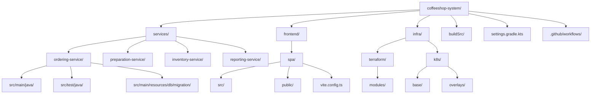
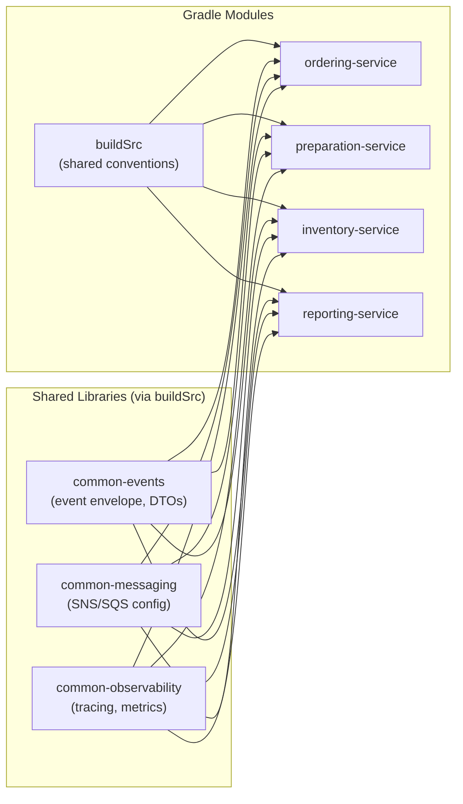

# Development Viewpoint

## Overview

The Coffeeshop Management System is organized as a mono-repo. Backend services are built with Java/Spring Boot using Gradle. The frontend SPA is built with TypeScript/React using Vite.

## Repository Structure

## Build Tools

| Component | Tool | Version | Purpose |
|-----------|------|---------|---------|
| Backend services | Gradle (Kotlin DSL) | 8.x | Build, test, dependency management |
| Frontend SPA | Vite | 5.x | Dev server, bundling, HMR |
| Infrastructure | Terraform | 1.7+ | AWS resource provisioning |
| Kubernetes manifests | Kustomize | 5.x | Environment-specific overlays |
| Container images | Docker | 24+ | Service containerization |

## Module Dependencies

## Technology Stack

| Layer | Technology |
|-------|-----------|
| Language (Backend) | Java 21 |
| Framework | Spring Boot 3.3 |
| Language (Frontend) | TypeScript 5.x |
| UI Framework | React 18 |
| Database migrations | Flyway |
| Messaging | AWS SNS + SQS (via Spring Cloud AWS) |
| ORM | Spring Data JPA / Hibernate |
| Testing | JUnit 5, Testcontainers, Vitest |
| API documentation | SpringDoc OpenAPI |

## Coding Standards

### Backend (Java)

- **Package structure**: `com.coffeeshop.{bc}.{layer}` (e.g., `com.coffeeshop.ordering.domain`, `com.coffeeshop.ordering.application`, `com.coffeeshop.ordering.infrastructure`)
- **Architecture**: Hexagonal (ports and adapters) within each service
- **Naming**: Domain objects use ubiquitous language from the bounded context
- **Error handling**: Domain exceptions translated to HTTP problem details (RFC 7807)
- **Testing**: Unit tests for domain logic, integration tests with Testcontainers for repository and messaging
- **Code style**: Google Java Format, enforced via Spotless Gradle plugin
- **Static analysis**: SpotBugs + Error Prone

### Frontend (TypeScript/React)

- **Structure**: Feature-based folder organization (`features/ordering/`, `features/preparation/`)
- **State management**: React Query for server state, Zustand for client state
- **Component style**: Functional components with hooks
- **Testing**: Vitest + React Testing Library
- **Linting**: ESLint + Prettier

## CI/CD Pipeline

| Stage | Tool | Trigger |
|-------|------|---------|
| Lint + format check | GitHub Actions | Every push |
| Unit tests | GitHub Actions | Every push |
| Integration tests | GitHub Actions | PR to main |
| Container build | GitHub Actions + Docker | Merge to main |
| Image push | Amazon ECR | Post-build |
| Deploy (staging) | ArgoCD | Image tag update |
| Deploy (production) | ArgoCD | Manual promotion |

## Branching Strategy

- **Main branch**: `main` -- always deployable
- **Feature branches**: `feature/{ticket-id}-short-description`
- **Release**: Continuous delivery from `main` to staging; manual promotion to production
- **Hotfix**: `hotfix/{ticket-id}-description`, merged to `main`
