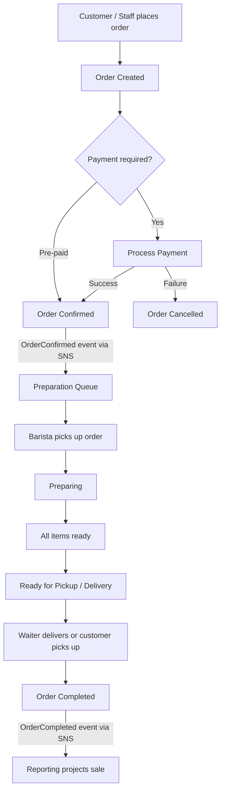
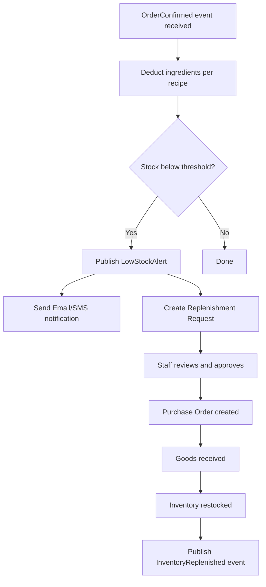
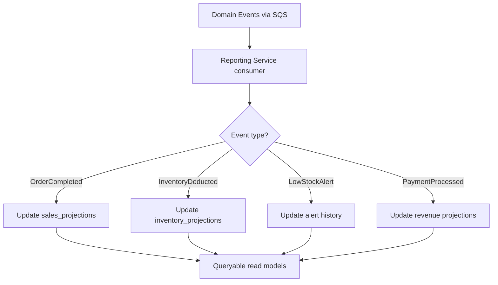

# Functional Viewpoint

## Overview

The system's functionality is organized around three primary flows that span the four bounded contexts. Communication between bounded contexts is asynchronous via SNS/SQS, ensuring loose coupling and independent deployability.

## Order Lifecycle Flow

## Inventory Flow

## Reporting Flow

## Bounded Context Responsibilities

| Bounded Context | Classification | Key Capabilities |
|----------------|---------------|-----------------|
| Ordering | Core | Order CRUD, payment processing, order state machine |
| Preparation | Core | Preparation queue, recipe lookup, item readiness tracking |
| Inventory | Supporting | Stock level management, threshold alerts, replenishment workflow |
| Reporting | Generic | Event consumption, read-model projection, dashboard queries |
