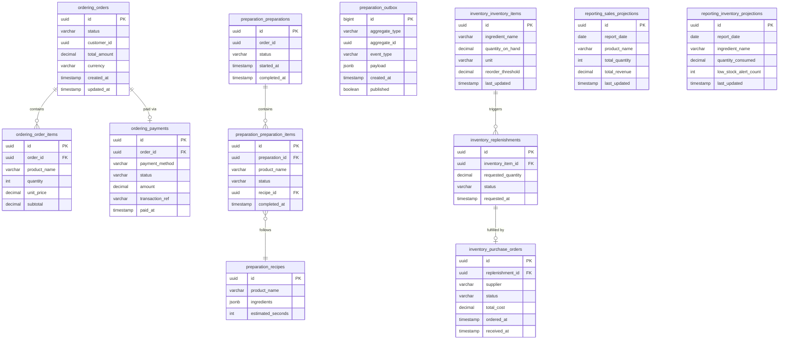

# Information Viewpoint

## Overview

Each bounded context owns a dedicated PostgreSQL schema within a shared RDS instance. Cross-schema access is prohibited at the application level; all data sharing occurs through domain events published via SNS/SQS.

## Data Model

## Schema Ownership

| Schema | Owner Service | Access Pattern |
|--------|--------------|----------------|
| `ordering` | Ordering Service | Read/Write |
| `preparation` | Preparation Service | Read/Write |
| `inventory` | Inventory Service | Read/Write |
| `reporting` | Reporting Service | Read/Write (projections only) |

## Data Flow Between Contexts

Data crosses bounded context boundaries exclusively through domain events:

- **Ordering -> Preparation**: `OrderConfirmed` event carries order items and product names
- **Ordering -> Inventory**: `OrderConfirmed` event triggers ingredient deduction
- **Ordering -> Reporting**: `OrderCompleted`, `PaymentProcessed` events feed sales projections
- **Inventory -> Reporting**: `InventoryDeducted`, `LowStockAlert` events feed inventory projections
- **Preparation -> Ordering**: `PreparationCompleted` event updates order status

## Data Retention

| Data Category | Retention | Strategy |
|---------------|-----------|----------|
| Orders and payments | 7 years | Regulatory requirement |
| Preparation records | 90 days | Operational relevance |
| Inventory transactions | 1 year | Audit trail |
| Reporting projections | Indefinite | Aggregated, low volume |
