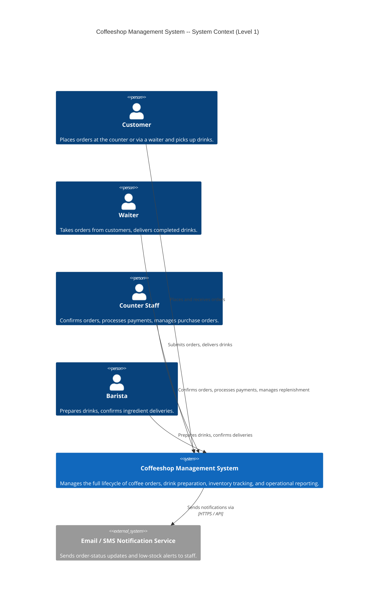

# C4 Level 1 -- System Context Diagram

## Coffeeshop Management System

The context diagram shows the Coffeeshop Management System as a single box, its four human actors, and the external notification system it depends on.

## Actor Responsibilities

| Actor | Primary Actions |
|-------|----------------|
| Customer | Place order, receive drink |
| Waiter | Submit order, deliver completed drink, mark order complete |
| Counter Staff | Confirm order, process payment, create purchase orders |
| Barista | Start preparation, complete preparation, confirm ingredient delivery |
