# C4 Level 2 -- Container Diagram

## Coffeeshop Management System

The container diagram zooms into the system boundary to show the frontend, API gateway, four backend services, databases, and messaging infrastructure.

```mermaid
C4Container
    title Coffeeshop Management System -- Container Diagram (Level 2)

    Person(waiter, "Waiter")
    Person(counterStaff, "Counter Staff")
    Person(barista, "Barista")

    System_Boundary(coffeeshop, "Coffeeshop Management System") {

        Container(spa, "Frontend SPA", "React / TypeScript", "Single-page application served via S3 + CloudFront.")
        Container(alb, "API Gateway / ALB", "AWS ALB", "Routes HTTP requests to backend services based on path prefix.")

        Container(ordering, "Ordering Service", "Java / Spring Boot :8081", "Manages order lifecycle: placement, confirmation, payment, delivery, completion.")
        Container(preparation, "Preparation Service", "Java / Spring Boot :8082", "Manages drink preparation workflow and recipe resolution.")
        Container(inventory, "Inventory Service", "Java / Spring Boot :8083", "Tracks ingredient stock levels and processes replenishment.")
        Container(reporting, "Reporting Service", "Java / Spring Boot :8084", "Aggregates operational data for dashboards and reports.")

        ContainerDb(rdsOrdering, "Ordering DB", "RDS PostgreSQL", "Orders, order items, payment records.")
        ContainerDb(rdsPreparation, "Preparation DB", "RDS PostgreSQL", "Preparations, preparation items, recipes.")
        ContainerDb(rdsInventory, "Inventory DB", "RDS PostgreSQL", "Inventory items, replenishment records.")
        ContainerDb(rdsReporting, "Reporting DB", "RDS PostgreSQL", "Materialized views, report snapshots.")

        Container(sns, "SNS Topics", "AWS SNS", "Publishes domain events: OrderPaid, PreparationCompleted, InventoryLow, etc.")
        Container(sqs, "SQS Queues", "AWS SQS", "Per-service queues that subscribe to relevant SNS topics.")
    }

    Container_Ext(s3cf, "S3 + CloudFront", "AWS S3 / CloudFront", "Hosts and delivers the frontend SPA globally.")
    System_Ext(notifications, "Email / SMS Service", "Sends alerts and status updates.")

    Rel(waiter, spa, "Uses", "HTTPS")
    Rel(counterStaff, spa, "Uses", "HTTPS")
    Rel(barista, spa, "Uses", "HTTPS")

    Rel(spa, s3cf, "Loaded from", "HTTPS")
    Rel(spa, alb, "API calls", "HTTPS / JSON")

    Rel(alb, ordering, "Routes /api/orders/**", "HTTP :8081")
    Rel(alb, preparation, "Routes /api/preparations/**", "HTTP :8082")
    Rel(alb, inventory, "Routes /api/inventory/**", "HTTP :8083")
    Rel(alb, reporting, "Routes /api/reports/**", "HTTP :8084")

    Rel(ordering, rdsOrdering, "Reads/Writes", "JDBC")
    Rel(preparation, rdsPreparation, "Reads/Writes", "JDBC")
    Rel(inventory, rdsInventory, "Reads/Writes", "JDBC")
    Rel(reporting, rdsReporting, "Reads/Writes", "JDBC")

    Rel(ordering, sns, "Publishes events", "AWS SDK")
    Rel(preparation, sns, "Publishes events", "AWS SDK")
    Rel(inventory, sns, "Publishes events", "AWS SDK")

    Rel(sns, sqs, "Fans out to", "SNS-SQS subscription")

    Rel(sqs, ordering, "Delivers events", "SQS poll")
    Rel(sqs, preparation, "Delivers events", "SQS poll")
    Rel(sqs, inventory, "Delivers events", "SQS poll")
    Rel(sqs, reporting, "Delivers events", "SQS poll")

    Rel(ordering, notifications, "Sends alerts", "HTTPS")
```

## Container Summary

| Container | Port | Technology | Database |
|-----------|------|------------|----------|
| Ordering Service | 8081 | Spring Boot | RDS PostgreSQL |
| Preparation Service | 8082 | Spring Boot | RDS PostgreSQL |
| Inventory Service | 8083 | Spring Boot | RDS PostgreSQL |
| Reporting Service | 8084 | Spring Boot | RDS PostgreSQL |
| Frontend SPA | -- | React / TypeScript | -- |
| API Gateway / ALB | 443 | AWS ALB | -- |

## Messaging Topology

- **SNS Topics**: `order-events`, `preparation-events`, `inventory-events`
- **SQS Queues**: One per consuming service per topic (e.g., `preparation-order-events-queue`, `inventory-preparation-events-queue`)
