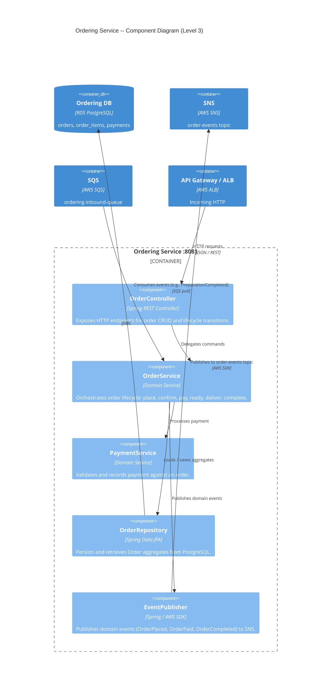

# C4 Level 3 -- Component Diagram: Ordering Service

## Ordering Service (port 8081)

Internal component breakdown of the Ordering bounded context.

## Component Responsibilities

| Component | Responsibility |
|-----------|---------------|
| OrderController | HTTP API surface; input validation and response mapping |
| OrderService | Core domain logic; enforces state-machine transitions on Order aggregate |
| PaymentService | Payment validation, idempotency checks, records payment |
| OrderRepository | Persistence of Order aggregate root and child entities |
| EventPublisher | Translates domain events to SNS messages; handles serialization and retry |
