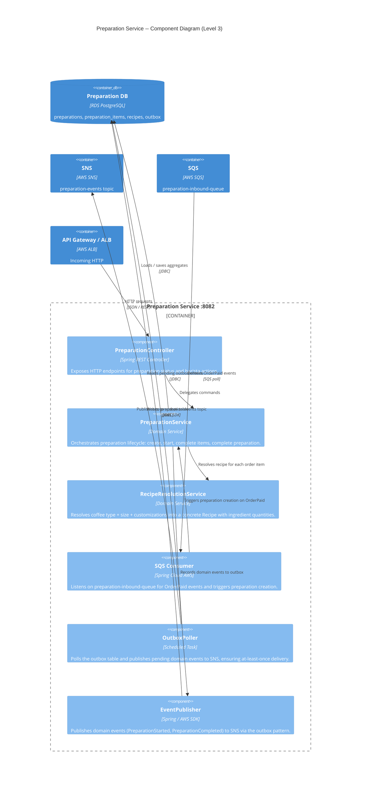

# C4 Level 3 -- Component Diagram: Preparation Service

## Preparation Service (port 8082)

Internal component breakdown of the Preparation bounded context.

## Component Responsibilities

| Component | Responsibility |
|-----------|---------------|
| PreparationController | HTTP API surface for barista interactions |
| PreparationService | Core domain logic; manages Preparation aggregate state transitions |
| RecipeResolutionService | Maps (CoffeeType, Size, Customizations) to a Recipe with precise Ingredient quantities |
| SQS Consumer | Receives OrderPaid events from the ordering-events SNS topic via SQS subscription |
| OutboxPoller | Guarantees at-least-once event publishing by polling the transactional outbox table |
| EventPublisher | Writes domain events into the outbox table within the same DB transaction as the aggregate change |
