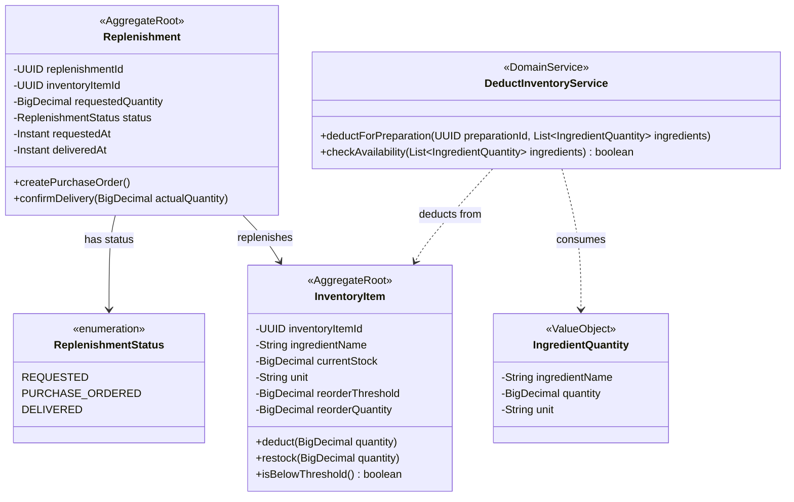

# Domain Model -- Inventory Bounded Context

## Class Diagram

## Invariants

- `currentStock` must never go below zero; a deduction that would cause negative stock must be rejected.
- A Replenishment can only transition Requested -> PurchaseOrdered -> Delivered.
- `confirmDelivery` restocks the linked InventoryItem by the actual delivered quantity.
- When `isBelowThreshold()` returns true after a deduction, an `InventoryLow` domain event is raised.
