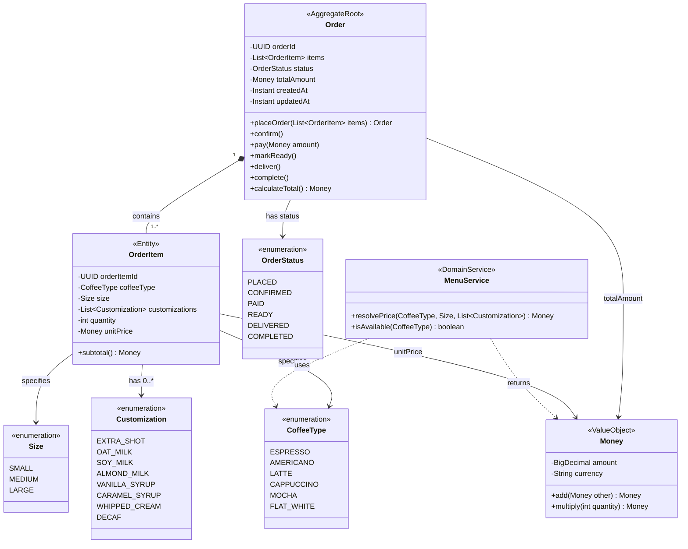

# Domain Model -- Ordering Bounded Context

## Class Diagram

## Invariants

- An Order must contain at least one OrderItem.
- State transitions follow the strict sequence: Placed -> Confirmed -> Paid -> Ready -> Delivered -> Completed.
- `totalAmount` must equal the sum of all `OrderItem.subtotal()` values.
- Payment amount must match `totalAmount` exactly.
