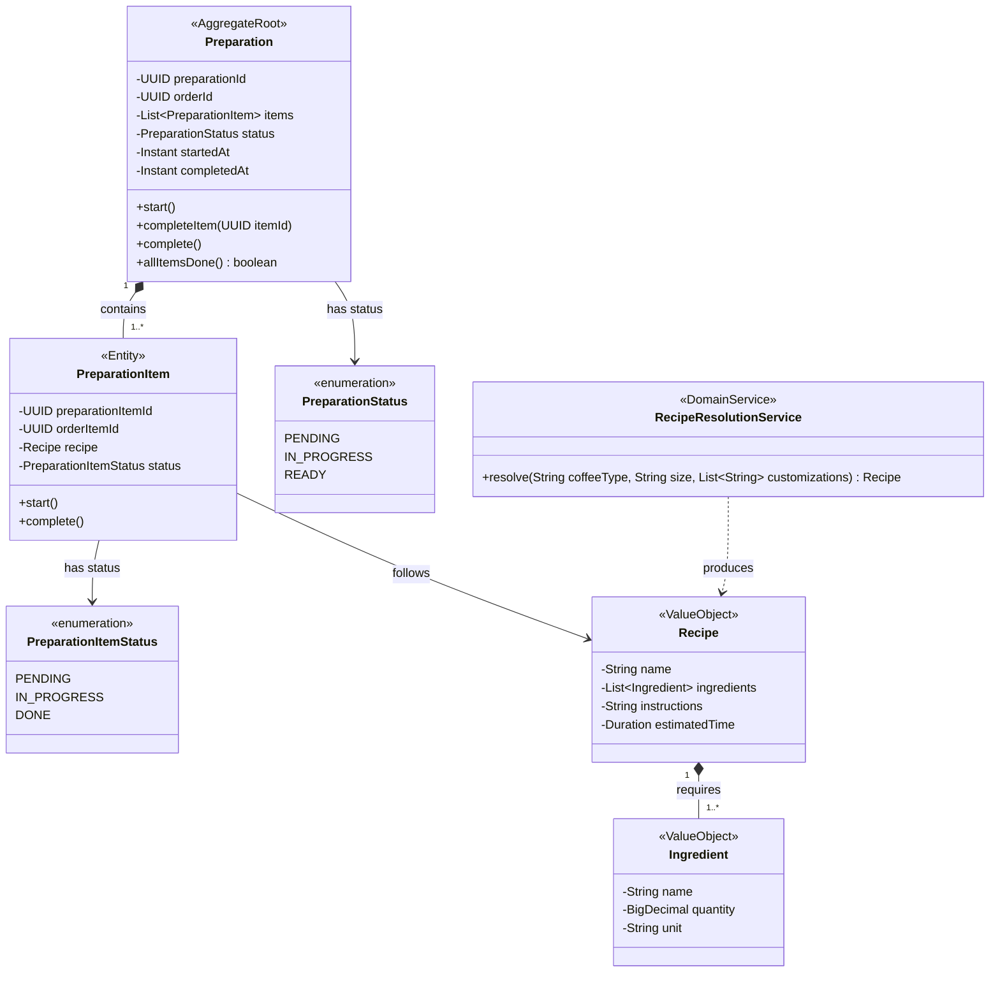

# Domain Model -- Preparation Bounded Context

## Class Diagram

## Invariants

- A Preparation can only move to READY when `allItemsDone()` returns true.
- A Preparation cannot be started if it is already IN_PROGRESS or READY.
- Each PreparationItem must have a resolved Recipe before preparation begins.
- The `orderId` links back to the Ordering BC but is treated as an opaque identifier (no direct coupling).
