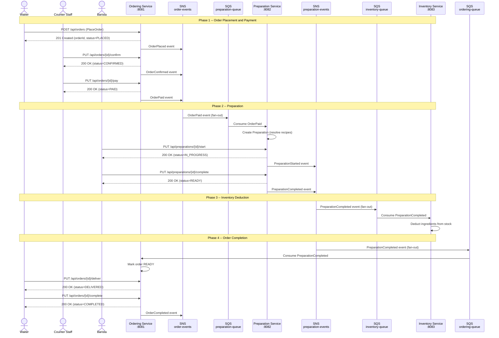

# Sequence Diagram -- Order Lifecycle

## Full Order Flow Across Services

## Phase Summary

| Phase | Trigger | Services Involved | Events Published |
|-------|---------|-------------------|-----------------|
| 1. Placement and Payment | Waiter, Counter Staff | Ordering | OrderPlaced, OrderConfirmed, OrderPaid |
| 2. Preparation | Barista | Preparation | PreparationStarted, PreparationCompleted |
| 3. Inventory Deduction | System (event-driven) | Inventory | InventoryDeducted, (InventoryLow) |
| 4. Order Completion | Waiter | Ordering | OrderCompleted |
