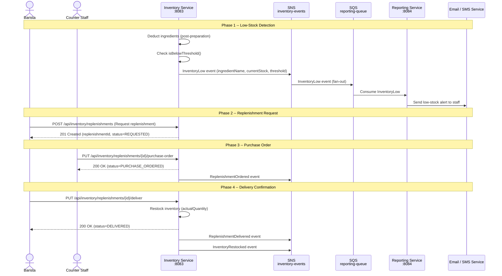

# Sequence Diagram -- Replenishment Flow

## Low-Stock Detection Through Delivery

## Phase Summary

| Phase | Actor | Action | Resulting State |
|-------|-------|--------|----------------|
| 1. Detection | System | Deduction triggers threshold check | InventoryLow event emitted |
| 2. Request | Barista | Requests replenishment | Replenishment = REQUESTED |
| 3. Purchase Order | Counter Staff | Creates purchase order | Replenishment = PURCHASE_ORDERED |
| 4. Delivery | Barista | Confirms physical delivery | Replenishment = DELIVERED, stock restored |
