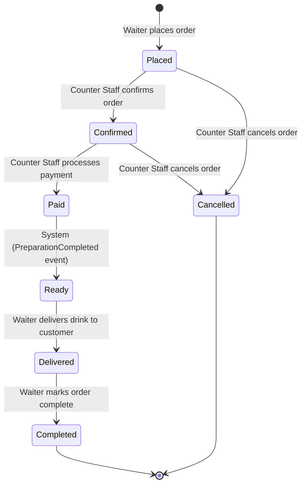

# State Machine -- Order

## Order Status Transitions

## Transition Detail

| From | To | Triggered By | Command / Event | Preconditions |
|------|----|-------------|-----------------|---------------|
| -- | Placed | Waiter | PlaceOrder command | At least one item, valid menu items |
| Placed | Confirmed | Counter Staff | ConfirmOrder command | Order exists in Placed state |
| Confirmed | Paid | Counter Staff | PayOrder command | Payment amount matches total |
| Paid | Ready | System | PreparationCompleted event (via SQS) | All preparation items completed |
| Ready | Delivered | Waiter | DeliverOrder command | Drink handed to customer |
| Delivered | Completed | Waiter | CompleteOrder command | Customer acknowledged |
| Placed | Cancelled | Counter Staff | CancelOrder command | Order not yet paid |
| Confirmed | Cancelled | Counter Staff | CancelOrder command | Order not yet paid |
