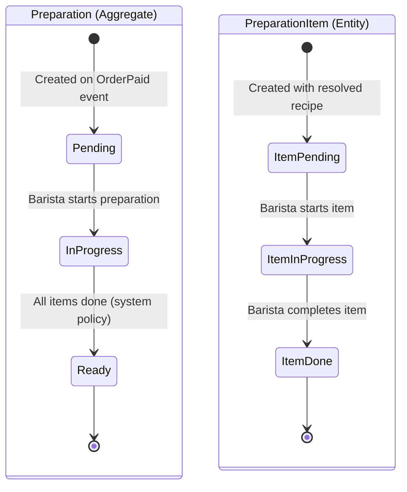

# State Machine -- Preparation

## Preparation Status Transitions

## Preparation-Level Transitions

| From | To | Triggered By | Preconditions |
|------|----|-------------|---------------|
| -- | Pending | System | OrderPaid event consumed; recipes resolved for all items |
| Pending | InProgress | Barista | At least one item exists |
| InProgress | Ready | System (policy) | `allItemsDone()` returns true |

## PreparationItem-Level Transitions

| From | To | Triggered By | Preconditions |
|------|----|-------------|---------------|
| -- | Pending | System | Recipe resolved for this item |
| Pending | InProgress | Barista | Parent Preparation is InProgress |
| InProgress | Done | Barista | Drink is prepared per recipe |

## Completion Policy

When the last PreparationItem transitions to Done, the Preparation aggregate automatically transitions from InProgress to Ready. This triggers a `PreparationCompleted` domain event published to SNS.
