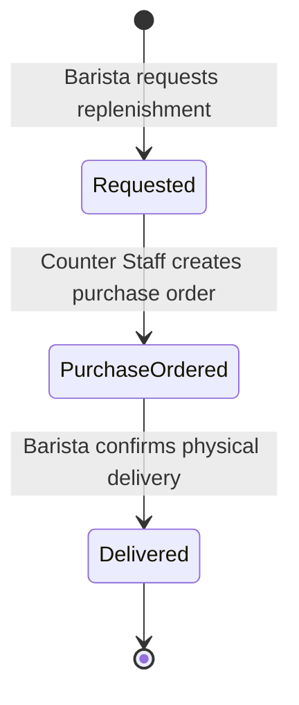

# State Machine -- Replenishment

## Replenishment Status Transitions

## Transition Detail

| From | To | Triggered By | Command | Side Effects |
|------|----|-------------|---------|-------------|
| -- | Requested | Barista | RequestReplenishment | Replenishment record created with requested quantity |
| Requested | PurchaseOrdered | Counter Staff | CreatePurchaseOrder | ReplenishmentOrdered event published to SNS |
| PurchaseOrdered | Delivered | Barista | ConfirmDelivery | InventoryItem restocked; ReplenishmentDelivered and InventoryRestocked events published |

## Notes

- The trigger for initiating a replenishment is typically an `InventoryLow` alert, but the Barista can also proactively request replenishment before the threshold is breached.
- On delivery confirmation, the actual delivered quantity may differ from the requested quantity. The system restocks by the actual amount.
- The Reporting service consumes replenishment events to track supply-chain metrics.
