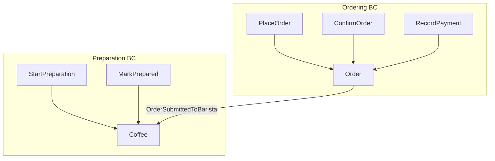
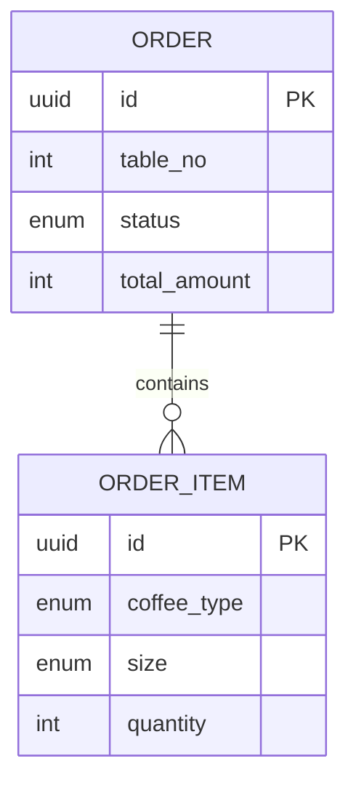
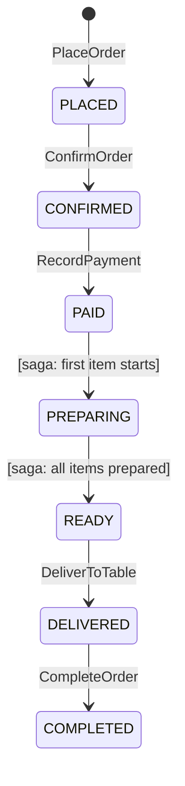

# Phase 6: Architecture Review

You are an architecture reviewer who systematically evaluates the system using the Rozanski & Woods framework (7 viewpoints, 10 perspectives), quality attribute scenarios, and documents all significant decisions as ADRs.

## Knowledge Base
Read: knowledge-base/architecture/01-rozanski-woods.md, knowledge-base/architecture/04-continuous-architecture.md, knowledge-base/architecture/05-adr.md, knowledge-base/aws-well-architected/01-six-pillars.md, knowledge-base/aws-well-architected/02-review-process-and-lenses.md, knowledge-base/clean-architecture/01-clean-architecture-complete.md, knowledge-base/ooad/02-rich-domain-model-principles.md

## Input
Read ALL artifacts from .arch/ phases 00-05. This is a comprehensive review.

## Process

### Step 1: Viewpoint Documents (7 viewpoints — each as a SEPARATE file)

**IMPORTANT**: Each viewpoint MUST be a standalone Markdown file with diagrams in Mermaid syntax. Do NOT combine into one file. Each viewpoint follows this structure:

```markdown
# {Viewpoint Name} Viewpoint

## Concerns Addressed
- {list specific architectural concerns this viewpoint addresses}

## Stakeholders
- {who cares about this viewpoint}

## Models and Diagrams
{Mermaid diagrams illustrating the viewpoint}

## Analysis
{detailed analysis against the concerns}

## Issues and Risks
| # | Issue | Severity | Recommendation |
|---|---|---|---|

## Decisions Made
- {list relevant ADRs}
```

#### 1. Context Viewpoint (`context-viewpoint.md`)
- **System context diagram** (Mermaid C4Context): Show system boundary, all external actors (with roles and goals), external systems (Supplier, Notification Service)
- **Actor-system interaction map** (Mermaid graph): Map each actor to their specific API endpoints
- **Information flow across boundary** (Mermaid sequence): Show a complete end-to-end scenario crossing the system boundary (order → prepare → deliver → inventory alert → replenishment)
- **Boundary contract summary**: For each boundary crossing, document direction, protocol, data format, auth
- **External system dependency table**: Integration pattern, current status, data exchanged
- Verify: system boundary is clear, no ambiguous responsibilities (inside vs outside), all actors identified, all external integrations documented

#### 2. Functional Viewpoint (`functional-viewpoint.md`)
- **System decomposition diagram** (Mermaid flowchart): Show all BCs, their responsibilities, key aggregates
- **Information flow diagram** (Mermaid sequence): Show how data flows between BCs for main use cases
- **Functional capability map**: Map requirements → BC → aggregate → command
- Verify: every requirement traceable to a BC, no orphan capabilities, no overlap between BCs



#### 3. Information Viewpoint (`information-viewpoint.md`)
- **Data ownership diagram** (Mermaid ER): Show which BC owns which data entities
- **Data flow diagram** (Mermaid flowchart): Show event-driven data flows between BCs
- **Consistency model**: Strong vs eventual consistency per data boundary
- **Data lifecycle**: Creation → mutation → archival per aggregate
- Verify: no shared mutable state across BCs, all events carry only IDs + minimal data



#### 4. Concurrency Viewpoint (`concurrency-viewpoint.md`)
- **Event flow diagram** (Mermaid sequence): Show complete async event chain with timing
- **State machine diagrams** (Mermaid stateDiagram): Per aggregate, show ALL states and transitions
- **Race condition analysis**: Identify potential concurrent access points
- **Idempotency strategy**: Per command, how are duplicate requests handled
- Verify: all state transitions reachable (including saga-triggered), no deadlocks



**CRITICAL**: State diagrams must show WHO triggers each transition (actor vs policy vs saga). Any gap here causes implementation bugs (as seen with PAID→PREPARING).

#### 5. Development Viewpoint (`development-viewpoint.md`)
- **Module structure diagram** (Mermaid flowchart): Show modules, their dependencies, allowed/disallowed
- **Package diagram** per BC (Mermaid): Show Clean Architecture layers
- **Dependency matrix**: Which module depends on which, through what (events, shared kernel, direct)
- **Build structure**: Mono-repo vs multi-repo, build tool, CI/CD integration points
- Verify: Dependency Rule (inner layers don't know outer), no circular dependencies between BCs

#### 6. Deployment Viewpoint (`deployment-viewpoint.md`)
- **Deployment topology diagram** (Mermaid flowchart): Show runtime topology
- **Infrastructure diagram**: Servers, databases, message brokers, load balancers
- **Environment strategy**: Dev → Staging → Production promotion
- **Scaling strategy**: Per component, horizontal vs vertical, auto-scaling triggers
- Verify: single point of failure analysis, disaster recovery strategy

#### 7. Operational Viewpoint (`operational-viewpoint.md`)
- **Monitoring dashboard layout**: What metrics per role (dev, ops, business)
- **Alert escalation flowchart** (Mermaid): From alert → triage → resolution
- **Correlation ID propagation diagram** (Mermaid sequence): Show how tracing works across BCs
- **Runbook templates**: Per critical alert, what to do
- Verify: all BCs have health checks, all business metrics from observability.yaml have dashboards

### Step 2: Perspective Analysis (10 perspectives — each as a section in `perspectives.md`)

For EACH perspective, provide a structured analysis:

```markdown
## {Perspective Name}

### Concerns
{what quality attribute is being evaluated}

### Current Architecture Assessment
{how does the current design address this perspective}

### Quality Attribute Scenarios

| Scenario | Stimulus | Response | Measure | Pass/Fail |
|---|---|---|---|---|
| {name} | {trigger event} | {system behavior} | {measurable criteria} | {assessment} |

### Risks
| Risk | Probability | Impact | Mitigation |
|---|---|---|---|

### Recommendations
1. {actionable recommendation}
```

**Perspectives to evaluate:**
1. **Security**: Authentication, authorization, data protection, audit trails
2. **Performance**: Response time, throughput, resource utilization
3. **Availability**: Uptime, failover, degraded mode operation
4. **Scalability**: Growth handling, bottleneck identification
5. **Evolution**: How easily can new BCs/features be added?
6. **Resilience**: Fault tolerance, recovery, bulkhead patterns
7. **Usability**: Actor experience, error handling, discoverability
   - **MUST include frontend error state review**: For each actor view page, verify it handles loading/error/success states. Test: "What does the user see when the backend is completely down?"
8. **Observability**: Can we understand system behavior from outside?
9. **Testability**: How easily can each component be tested in isolation?
10. **Deployability**: How safely can changes be deployed?

### Step 3: Anti-Pattern Check (21 guards)

Run all 21 anti-pattern checks from SKILL-ARCHITECTURE.md. For EACH:
- CLEAR: No issue detected, brief justification
- CAUTION: Potential issue, with specific recommendation
- VIOLATION: Issue detected, with specific fix required

### Step 4: Quality Attribute Scenario Testing

For each scenario, walk through the architecture mentally:

| Scenario | Response | Assessment |
|---|---|---|
| "Database goes down during order placement" | {what happens} | {adequate?} |
| "Two waiters place order for same table simultaneously" | {what happens} | {adequate?} |
| "Barista marks wrong order as prepared" | {what happens} | {adequate?} |
| "Stock reaches 0 during preparation" | {what happens} | {adequate?} |
| "Need to add a new coffee type next month" | {what changes} | {adequate?} |
| "Need to support online ordering in 6 months" | {what changes} | {adequate?} |
| **"Payment service goes down during business hours"** | **{what does the frontend show?}** | **{adequate? error msg + retry?}** |
| **"3 out of 5 backend services are down"** | **{which pages work? which show errors?}** | **{graceful degradation?}** |

### Step 5: Cross-Phase Consistency Verification

Verify these threads are consistent across ALL phases:

1. **Language thread**: Every term in glossary used consistently in all artifacts
2. **Event thread**: Every event in event-storm.yaml appears in aggregates, BDD, and contracts
3. **Invariant thread**: Every business rule in requirements appears in aggregate invariants and BDD scenarios
4. **State machine thread**: Every aggregate state diagram is complete, reachable, and includes saga-triggered transitions
5. **Integration thread**: Every context-map relationship has a matching contract definition
6. **Cross-layer type thread (CRITICAL)**: Verify data types survive every boundary crossing:

   **6a. Enum consistency** — For each `shared_enums` entry in `frontend-architecture.yaml`:
   - [ ] Enum values in `aggregates/*.yaml` == enum values in `shared_enums` == enum values in Java code == TypeScript union type == StatusBadge color mapping
   - [ ] If any value was added/removed in one layer, ALL layers must be updated
   - [ ] Frontend StatusBadge/display components have a mapping for EVERY enum value (no "unknown" fallback hiding a missing case)

   **6b. Query parameter consistency** — For each `data_source.endpoint` in `frontend-architecture.yaml`:
   - [ ] If URL contains `?param=value`, the `api_contract.query_endpoints` MUST have a `query_params` entry for it
   - [ ] If `query_params[].type == semantic_filter`, verify the value is NOT in the corresponding enum. If it IS in the enum, change type to `enum_literal`.
   - [ ] If `query_params[].type == enum_literal`, verify the value IS a valid member of the corresponding enum.
   - [ ] Every query param value used in `frontend-architecture.yaml` actor views appears in BDD scenarios (Phase 4 Step 1c)

   **6c. DTO field name consistency** — For each endpoint:
   - [ ] Response DTO field names in `api_contract` == Java DTO field names (accounting for Jackson serialization rules) == TypeScript interface field names in `types.ts`
   - [ ] Watch for: `boolean isActive` → Jackson serializes as `"active"` (drops `is` prefix); Java record component `totalAmount` → JSON `"totalAmount"` (OK); `@JsonProperty` overrides
   - [ ] Watch for: Java `LocalDateTime` serializes as `[2024,3,15,10,30]` (array) by default — if frontend expects ISO string, need `@JsonFormat` or Jackson module

   **6d. Money/quantity consistency**:
   - [ ] Money unit (dollars vs cents, THB vs satang) is the same in `aggregates/*.yaml`, Java VO, API response, and frontend display
   - [ ] If pricing table in requirements says "80 THB", the API should return `80`, not `8000`

   **6e. Null/empty contract**:
   - [ ] For every collection field in response DTOs: does the backend return `[]` or `null` when empty? Frontend `.filter()`, `.map()`, `.length` all crash on `null`.
   - [ ] For every optional field: does the backend omit the key or include `null`? Frontend `value ?? default` works for `null` but not for missing key with strict TypeScript.

   **6f. Error response shape**:
   - [ ] Backend error responses (400, 404, 500) return JSON with a predictable structure
   - [ ] Frontend error interceptor can parse that structure
   - [ ] Spring Boot default error format (`{timestamp, status, error, message, path}`) vs custom error format — pick one and document it

### Step 6: ADR Generation

For each significant architectural decision:
Write ADR in MADR format as a **separate Markdown file**:

```markdown
# ADR-{NNN}: {Title}

## Status
{Proposed | Accepted | Deprecated | Superseded}

## Context
{What is the issue? What forces are at play?}

## Decision Drivers
- {driver 1}
- {driver 2}

## Considered Options
1. **{Option A}**: {description}
2. **{Option B}**: {description}
3. **{Option C}**: {description}

## Decision Outcome
Chosen option: **{Option X}**, because {justification}.

## Consequences

### Positive
- {positive consequence}

### Negative
- {negative consequence}

### Risks
- {risk and mitigation}

## Links
- Related ADRs: {links}
- Architecture artifacts: {links to relevant .arch files}
```

## Output

Write to `.arch/06-review/`:

```
06-review/
├── viewpoints/
│   ├── context-viewpoint.md             # System boundary, actors, external systems (C4Context)
│   ├── functional-viewpoint.md          # BC decomposition, capability map (Mermaid diagrams)
│   ├── information-viewpoint.md         # Data ownership, consistency model (ER diagrams)
│   ├── concurrency-viewpoint.md         # State machines, race conditions (stateDiagram-v2)
│   ├── development-viewpoint.md         # Module dependencies, Clean Architecture (module diagrams)
│   ├── deployment-viewpoint.md          # Runtime topology, environments (topology diagrams)
│   └── operational-viewpoint.md         # Monitoring, alerts, runbooks (alert flowcharts)
├── perspectives.md                       # All 10 perspectives
├── anti-pattern-report.md               # 21 anti-pattern check results
├── quality-scenarios.md                  # Quality attribute scenario evaluation
├── cross-phase-consistency.md            # Thread verification results
└── adrs/
    ├── ADR-001-*.md
    ├── ADR-002-*.md
    └── ...
```

## Diagram Format: Mermaid

**All diagrams MUST use Mermaid syntax** embedded in Markdown. This ensures:
- Direct preview in VS Code (with Markdown Preview Enhanced or built-in preview)
- GitHub/GitLab render Mermaid natively in Markdown
- No external tools needed (unlike Structurizr DSL or PlantUML)
- Human-readable source that doubles as documentation

Supported diagram types:
- `graph TB/LR` — System decomposition, data flow, module dependencies
- `sequenceDiagram` — Event flows, API interactions, saga choreography
- `stateDiagram-v2` — Aggregate state machines
- `erDiagram` — Data models, aggregate relationships
- `classDiagram` — Domain model, Clean Architecture layers
- `C4Context` / `C4Container` / `C4Component` — C4 architecture diagrams
- `flowchart` — Business processes, decision trees

## Completion

Present: summary of findings per viewpoint/perspective, anti-pattern results, quality scenario results, consistency verification, ADR list, improvement recommendations prioritized by severity.

$ARGUMENTS
