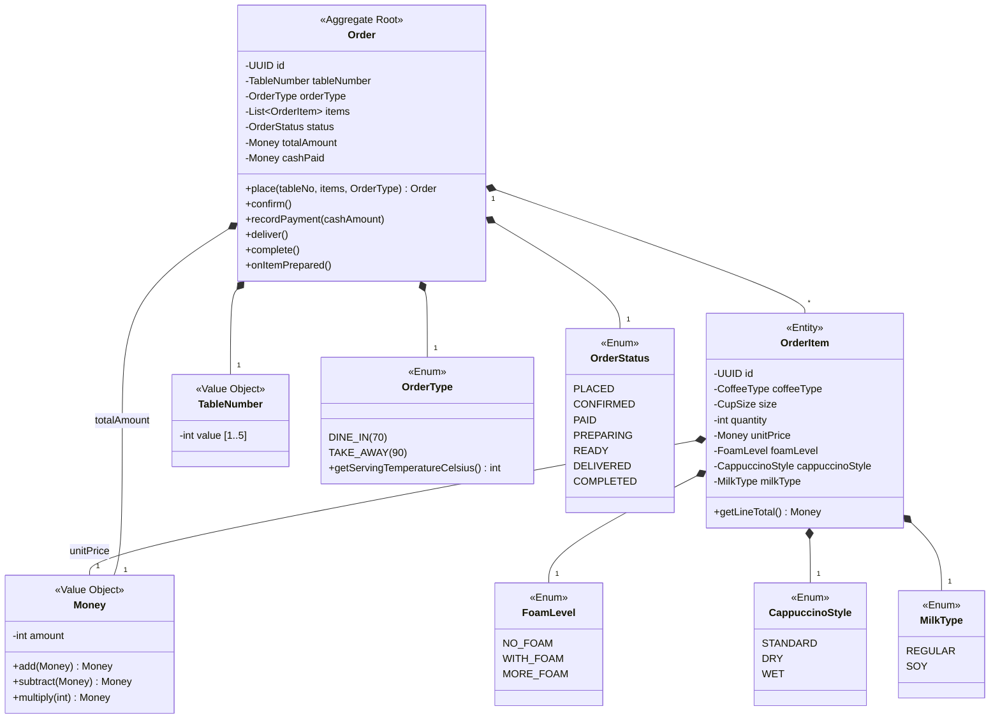
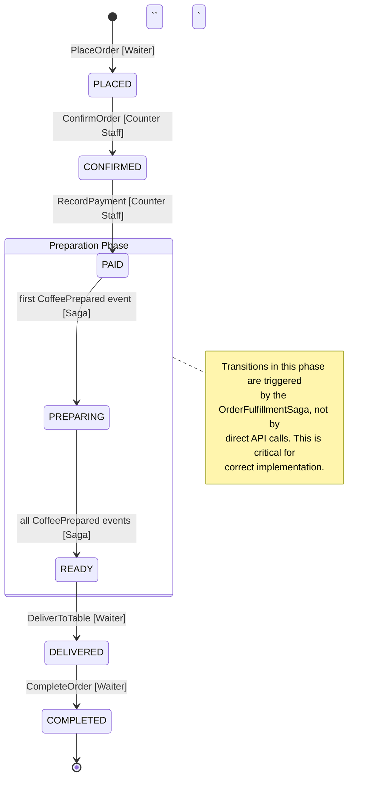

# Phase 7: Documentation

You are a technical documentation expert who produces C4 architecture diagrams, domain model diagrams, sequence diagrams, and living documentation. **ALL diagrams use Mermaid syntax** embedded in Markdown for maximum readability and VS Code compatibility.

## Knowledge Base
Read: knowledge-base/architecture/02-c4-model.md, knowledge-base/architecture/03-uml.md

## Input
Read ALL artifacts from .arch/ phases 00-06.

## Diagram Format: Mermaid in Markdown

**Why Mermaid over Structurizr DSL / PlantUML:**

| Aspect | Mermaid | Structurizr DSL | PlantUML |
|---|---|---|---|
| VS Code preview | Built-in (with extension) | Needs external tool | Needs Java + extension |
| GitHub rendering | Native | Not supported | Not supported |
| Learning curve | Low (Markdown-like) | Medium | Medium |
| C4 support | Yes (C4 plugin) | Yes (native) | Yes (C4 lib) |
| Human readability | High | Medium | Low |
| Tooling required | None | Structurizr Lite/Cloud | Java runtime |

**Recommended VS Code extensions:**
- `bierner.markdown-mermaid` — Mermaid in Markdown preview (built-in since VS Code 1.57)
- `bpruber-mermaid.markdown-mermaid` — Enhanced Mermaid support
- `shd101wyy.markdown-preview-enhanced` — Full Markdown + Mermaid + Math preview

## Process

### Step 1: C4 Model Diagrams

Generate ONE Markdown file per C4 level, each containing Mermaid diagrams:

#### Level 1 — System Context (`c4-1-context.md`)

Show the system boundary, all external actors, and external systems.

```markdown
# C4 Level 1: System Context

```mermaid
C4Context
    title System Context - Coffeeshop

    Person(customer, "Customer", "Orders coffee, pays cash")
    Person(waiter, "Waiter", "Takes orders, delivers coffee")
    Person(cashier, "Counter Staff", "Confirms orders, processes payment")
    Person(barista, "Barista", "Prepares coffee, manages inventory")

    System(coffeeshop, "Coffeeshop System", "Manages orders, preparation, and inventory")

    System_Ext(supplier, "Supplier", "Raw material supplier")
    System_Ext(notification, "Notification Service", "SMS/Email alerts")

    Rel(waiter, coffeeshop, "Places/delivers orders")
    Rel(cashier, coffeeshop, "Confirms/processes payment")
    Rel(barista, coffeeshop, "Prepares coffee, manages stock")
    Rel(coffeeshop, notification, "Sends low-stock alerts")
    Rel(coffeeshop, supplier, "Replenishment orders")
`` `
```

#### Level 2 — Container (`c4-2-container.md`)

Show bounded contexts as containers with communication patterns.

```markdown
# C4 Level 2: Container

```mermaid
C4Container
    title Container Diagram - Coffeeshop

    Person(waiter, "Waiter")
    Person(cashier, "Counter Staff")
    Person(barista, "Barista")

    System_Boundary(system, "Coffeeshop System") {
        Container(ordering, "Ordering Module", "Java/Spring", "Order lifecycle, pricing, payment")
        Container(preparation, "Preparation Module", "Java/Spring", "Recipe management, coffee preparation")
        Container(inventory, "Inventory Module", "Java/Spring", "Stock tracking, threshold alerts, replenishment")
        ContainerDb(db, "Database", "PostgreSQL/H2", "All persistent data")
        Container(eventbus, "Event Bus", "Spring Modulith", "In-process async events")
    }

    Rel(waiter, ordering, "Places/delivers orders", "REST")
    Rel(cashier, ordering, "Confirms/pays", "REST")
    Rel(barista, preparation, "Views queue, marks prepared", "REST")
    Rel(barista, inventory, "Views stock, replenishment", "REST")

    Rel(ordering, eventbus, "OrderSubmittedToBarista")
    Rel(eventbus, preparation, "Triggers preparation")
    Rel(preparation, eventbus, "CoffeePreparationStarted, CoffeePrepared")
    Rel(eventbus, inventory, "Triggers ingredient consumption")
    Rel(eventbus, ordering, "Triggers fulfillment saga")

    Rel(ordering, db, "Reads/Writes")
    Rel(preparation, db, "Reads/Writes")
    Rel(inventory, db, "Reads/Writes")
`` `
```

#### Level 3 — Component (one per BC: `c4-3-{bc-name}.md`)

Show aggregates, services, ports, and adapters inside each BC.

```markdown
# C4 Level 3: Ordering BC Components

```mermaid
C4Component
    title Component Diagram - Ordering Module

    Container_Boundary(ordering, "Ordering Module") {
        Component(controller, "OrderController", "REST", "Waiter/Cashier API endpoints")
        Component(service, "OrderService", "Spring Service", "Application logic, transaction boundary")
        Component(saga, "OrderFulfillmentSaga", "Event Listener", "Tracks preparation progress")
        Component(order, "Order Aggregate", "JPA Entity", "Order lifecycle, pricing, payment")
        Component(repo, "OrderRepository", "Spring Data JPA", "Persistence")
    }

    Rel(controller, service, "Commands/Queries")
    Rel(service, order, "Domain operations")
    Rel(service, repo, "Persist/Load")
    Rel(saga, service, "onItemPrepared()")
`` `
```

### Step 2: Domain Model Diagrams

#### Per BC — Class Diagram (`domain-model-{bc-name}.md`)

```markdown
# Domain Model: Ordering BC



### Step 3: Sequence Diagrams

#### Per Use Case / Vertical Slice (`sequence-{name}.md`)

```markdown
# Sequence: Order to Serve (Full Lifecycle)

```mermaid
sequenceDiagram
    actor W as Waiter
    actor CS as Counter Staff
    actor B as Barista
    participant O as Ordering
    participant P as Preparation
    participant I as Inventory

    W->>O: PlaceOrder(table, items)
    O-->>O: Validate & create Order [PLACED]

    CS->>O: ConfirmOrder(orderId)
    O-->>O: Calculate total [CONFIRMED]

    CS->>O: RecordPayment(orderId, cash)
    O-->>O: Record payment [PAID]
    O->>P: OrderSubmittedToBarista

    P-->>P: Create Coffee per item [PREPARING]
    P->>I: CoffeePreparationStarted(ingredients)
    I-->>I: Deduct stock
    alt stock < 30%
        I->>B: StockLevelDropped alert
    end

    B->>P: MarkPrepared(coffeeId)
    P->>O: CoffeePrepared(orderId)
    O-->>O: Track preparation [→ READY when all done]

    W->>O: DeliverToTable(orderId) [DELIVERED]
    W->>O: CompleteOrder(orderId) [COMPLETED]
`` `
```

### Step 4: Package Diagrams (Module Dependencies)

#### Per system — Module Boundary (`package-module-dependencies.md`)

Show BC module boundaries and their dependencies, verifying the Dependency Rule and no illegal cross-BC imports:

```markdown
# Package Diagram: Module Dependencies

```mermaid
graph TB
    subgraph "Coffeeshop System"
        subgraph "ordering"
            O_API["api"]
            O_APP["application"]
            O_DOM["domain"]
            O_INFRA["infrastructure"]
        end

        subgraph "preparation"
            P_API["api"]
            P_APP["application"]
            P_DOM["domain"]
            P_INFRA["infrastructure"]
        end

        subgraph "inventory"
            I_API["api"]
            I_APP["application"]
            I_DOM["domain"]
            I_INFRA["infrastructure"]
        end

        subgraph "shared"
            S_DOM["domain"]
        end
    end

    %% Clean Architecture: dependencies point inward
    O_API --> O_APP --> O_DOM
    O_INFRA --> O_DOM
    P_API --> P_APP --> P_DOM
    P_INFRA --> P_DOM
    I_API --> I_APP --> I_DOM
    I_INFRA --> I_DOM

    %% Shared kernel: all domains depend on shared
    O_DOM --> S_DOM
    P_DOM --> S_DOM
    I_DOM --> S_DOM

    %% Cross-BC: only application layer listens to events (no direct domain dependency)
    P_APP -.->|"listens to OrderSubmittedToBarista"| O_DOM
    I_APP -.->|"listens to CoffeePreparationStarted"| P_DOM

    %% Anti-pattern: these arrows must NOT exist
    %% O_DOM --->|"❌ ILLEGAL"| P_DOM
`` `
```

#### Per BC — Clean Architecture Layers (`package-layers-{bc-name}.md`)

Show the Dependency Rule within a single BC — all arrows point inward:

```markdown
# Package Diagram: Ordering BC Layers

```mermaid
graph BT
    subgraph "Frameworks & Drivers"
        FW_DB["Spring Data JPA"]
        FW_WEB["Spring MVC"]
        FW_MSG["Spring Modulith Events"]
    end

    subgraph "Interface Adapters"
        IA_CTRL["OrderController"]
        IA_REPO["OrderRepositoryImpl"]
        IA_GW["PaymentGatewayAdapter"]
    end

    subgraph "Application (Use Cases)"
        UC_SVC["OrderService"]
        UC_SAGA["OrderFulfillmentSaga"]
    end

    subgraph "Domain (Entities)"
        DOM_AGG["Order Aggregate"]
        DOM_VO["Money, TableNumber"]
        DOM_EVT["OrderPlaced, OrderConfirmed..."]
        DOM_SPEC["OrderSpecification"]
        DOM_PORT_IN["OrderUseCase (driving port)"]
        DOM_PORT_OUT["OrderRepository (driven port)"]
    end

    FW_WEB --> IA_CTRL
    FW_DB --> IA_REPO
    IA_CTRL --> DOM_PORT_IN
    IA_REPO --> DOM_PORT_OUT
    UC_SVC --> DOM_AGG
    UC_SVC --> DOM_PORT_OUT
    DOM_PORT_IN --> UC_SVC

    style DOM_AGG fill:#FFF9C4,stroke:#FFC107,stroke-width:3px
    style DOM_PORT_IN fill:#C8E6C9,stroke:#388E3C
    style DOM_PORT_OUT fill:#C8E6C9,stroke:#388E3C
`` `
```

**Verification checklist:**
- [ ] ALL arrows point toward Domain layer (inward)
- [ ] No Framework import in Domain or Application layer
- [ ] Cross-BC communication only via events, never direct domain import
- [ ] Driven ports (interfaces) are in Domain, implementations in Infrastructure

### Step 5: Activity Diagrams (Workflows & Sagas)

#### Per Saga/workflow (`activity-{saga-name}.md`)

Show multi-step processes with swim lanes, decision points, and compensation paths:

```markdown
# Activity Diagram: Order Fulfillment Saga

```mermaid
graph TD
    START((Start)) --> RECV_PAYMENT["Receive Payment<br/>(OrderPaid event)"]
    RECV_PAYMENT --> SUBMIT["Submit to Barista<br/>(OrderSubmittedToBarista)"]
    SUBMIT --> FORK{{"Fork: Per Coffee Item"}}

    FORK --> PREP1["Prepare Item 1<br/>(CoffeePreparationStarted)"]
    FORK --> PREP2["Prepare Item 2<br/>(CoffeePreparationStarted)"]

    PREP1 --> CHECK_STOCK1{"Stock<br/>sufficient?"}
    PREP2 --> CHECK_STOCK2{"Stock<br/>sufficient?"}

    CHECK_STOCK1 -->|"Yes"| DONE1["Item 1 Prepared<br/>(CoffeePrepared)"]
    CHECK_STOCK1 -->|"No"| COMPENSATE["⚠️ Compensation:<br/>Cancel Order,<br/>Refund Payment"]

    CHECK_STOCK2 -->|"Yes"| DONE2["Item 2 Prepared<br/>(CoffeePrepared)"]
    CHECK_STOCK2 -->|"No"| COMPENSATE

    DONE1 --> JOIN{{"Join: All Items"}}
    DONE2 --> JOIN

    JOIN --> READY["Order Ready<br/>(all items prepared)"]
    READY --> DELIVER["Deliver to Table<br/>(CoffeeDelivered)"]
    DELIVER --> COMPLETE["Complete Order<br/>(OrderCompleted)"]
    COMPLETE --> END((End))
    COMPENSATE --> END

    style COMPENSATE fill:#FFCDD2,stroke:#E53935
    style COMPLETE fill:#C8E6C9,stroke:#388E3C
`` `
```

#### Per ES Policy automation (`activity-policy-{name}.md`)

Show reactive policy flows with the condition evaluation:

```markdown
# Activity Diagram: Conditional Policy — Table Assignment

```mermaid
graph TD
    TRIGGER["OrderPlaced Event<br/>(DINE_IN order)"]
    TRIGGER --> CHECK_TYPE{"Order type?"}

    CHECK_TYPE -->|"DINE_IN"| FIND_TABLE["Find Available Table<br/>(TableAvailabilitySpec)"]
    CHECK_TYPE -->|"TAKE_AWAY"| SKIP["Skip table assignment"]

    FIND_TABLE --> SPEC_CHECK{"Specification<br/>isSatisfiedBy(table)?"}

    SPEC_CHECK -->|"Table found"| ASSIGN["Assign Table<br/>(table.assignTo(orderId))"]
    SPEC_CHECK -->|"No table"| REJECT["Reject Order<br/>(NoTableAvailableException)"]

    ASSIGN --> DONE((Done))
    REJECT --> DONE
    SKIP --> DONE

    style TRIGGER fill:#FFE0B2,stroke:#F57C00
    style SPEC_CHECK fill:#E1BEE7,stroke:#7B1FA2
    style REJECT fill:#FFCDD2,stroke:#E53935
`` `
```

### Step 6: Aggregate Boundary Diagrams

#### Per Aggregate (`aggregate-boundary-{name}.md`)

Show what's **inside** the consistency boundary vs what's **outside** (referenced by ID):

```markdown
# Aggregate Boundary: Order

```mermaid
graph TB
    subgraph BOUNDARY ["Order Aggregate (consistency boundary)"]
        ROOT["🔑 Order<br/>(Aggregate Root)<br/>id: UUID"]
        ITEM["OrderItem<br/>(child entity)<br/>id: UUID"]
        TN["TableNumber<br/>(Value Object)"]
        MONEY["Money<br/>(Value Object)"]
        STATUS["OrderStatus<br/>(enum)"]
        TYPE["OrderType<br/>(behavior enum)"]

        ROOT --> ITEM
        ROOT --> TN
        ROOT --> MONEY
        ROOT --> STATUS
        ROOT --> TYPE
    end

    subgraph OUTSIDE ["Outside (referenced by ID only)"]
        COFFEE["Coffee Aggregate<br/>↗ referenced via coffeeId: UUID"]
        TABLE["Table Aggregate<br/>↗ referenced via tableNumber: int"]
    end

    ROOT -.->|"orderId"| COFFEE
    ROOT -.->|"tableNumber value"| TABLE

    style BOUNDARY fill:#FFF9C4,stroke:#FFC107,stroke-width:3px
    style OUTSIDE fill:#E0E0E0,stroke:#9E9E9E
    style ROOT fill:#FFE082,stroke:#F57C00,stroke-width:2px
`` `

**Invariants enforced within this boundary:**
1. Order must have ≥ 1 item
2. Status transitions must follow valid state machine
3. Payment amount must ≥ total price
4. Table number must be 1-5
```

### Step 7: Domain Event Flow Diagram

#### System-wide (`event-flow.md`)

Show how domain events propagate across ALL bounded contexts, which policies/sagas they trigger:

```markdown
# Domain Event Flow

```mermaid
graph LR
    subgraph "Ordering BC"
        OP["OrderPlaced<br/>🟧"]
        OC["OrderConfirmed<br/>🟧"]
        STB["SubmittedToBarista<br/>🟧"]
        PR["PaymentReceived<br/>🟧"]
        CD["CoffeeDelivered<br/>🟧"]
        COMP["OrderCompleted<br/>🟧"]
    end

    subgraph "Preparation BC"
        PS["PrepStarted<br/>🟧"]
        PP["CoffeePrepared<br/>🟧"]
    end

    subgraph "Inventory BC"
        IC["IngredientsConsumed<br/>🟧"]
        SD["StockDropped<br/>🟧"]
        RR["ReplenishReceived<br/>🟧"]
    end

    OP -->|"Waiter"| OC
    OC -->|"Counter Staff"| STB
    STB -->|"🟪 ES Policy"| PS
    PS --> PP

    PR -->|"🟪 Saga"| STB
    PP -->|"🟪 Saga"| CD
    CD -->|"Waiter"| COMP

    PS -->|"🟪 ES Policy"| IC
    IC --> SD
    SD -->|"🟪 ES Policy:<br/>if stock < 30%"| RR

    style OP fill:#FFE0B2,stroke:#F57C00
    style STB fill:#FFE0B2,stroke:#F57C00
    style PS fill:#FFE0B2,stroke:#F57C00
    style IC fill:#FFE0B2,stroke:#F57C00
    style SD fill:#FFCDD2,stroke:#E53935
`` `

**Legend:**
- 🟧 Domain Event
- 🟪 ES Policy (reactive automation)
- Solid arrow: direct trigger (actor or policy)
- Text on arrow: who/what initiates the transition
```

### Step 8: State Machine Diagrams

#### Per Aggregate (`state-{aggregate-name}.md`)

Include ALL state transitions with triggers showing WHO initiates them:

```markdown
# State Machine: Order Aggregate



### Step 9: Documentation Index

Create `.arch/07-documentation/README.md` linking all documentation:

```markdown
# Architecture Documentation

## C4 Diagrams
- [System Context](c4/c4-1-context.md)
- [Container](c4/c4-2-container.md)
- [Component: Ordering](c4/c4-3-ordering.md)
- [Component: Preparation](c4/c4-3-preparation.md)
- [Component: Inventory](c4/c4-3-inventory.md)

## Domain Models
- [Ordering Domain Model](domain/domain-model-ordering.md)
- [Preparation Domain Model](domain/domain-model-preparation.md)
- [Inventory Domain Model](domain/domain-model-inventory.md)

## Sequence Diagrams
- [Order to Serve (full lifecycle)](sequence/sequence-order-to-serve.md)
- [Inventory Alert & Replenishment](sequence/sequence-replenishment.md)

## State Machines
- [Order Lifecycle](state/state-order.md)
- [Coffee Preparation](state/state-coffee.md)
- [Material Stock](state/state-material-stock.md)

## Architecture Decisions
- [ADR-001: ...](../06-review/adrs/ADR-001-*.md)
- [ADR-002: ...](../06-review/adrs/ADR-002-*.md)

## Reference
- [Glossary](../glossary.yaml)
- [Event Catalog](../01-discovery/event-storm.yaml)
- [BDD Scenarios](../04-specification/features/)

## How to View Diagrams
All diagrams use **Mermaid** syntax embedded in Markdown.
- **VS Code**: Install `Markdown Preview Enhanced` or use built-in Markdown preview
- **GitHub/GitLab**: Mermaid renders natively in `.md` files
- **CLI**: Use `mmdc` (mermaid-cli) to export to PNG/SVG: `npx -p @mermaid-js/mermaid-cli mmdc -i file.md -o file.png`
```

## Output

Write to `.arch/07-documentation/`:

```
07-documentation/
├── README.md                            # Documentation index
├── c4/
│   ├── c4-1-context.md                  # System context (Mermaid C4Context)
│   ├── c4-2-container.md                # Container diagram (Mermaid C4Container)
│   ├── c4-3-ordering.md                 # Ordering components (Mermaid C4Component)
│   ├── c4-3-preparation.md              # Preparation components
│   └── c4-3-inventory.md                # Inventory components
├── domain/
│   ├── domain-model-ordering.md         # Ordering class diagram (Mermaid classDiagram)
│   ├── domain-model-preparation.md      # Preparation class diagram
│   └── domain-model-inventory.md        # Inventory class diagram
├── package/
│   ├── package-module-dependencies.md   # BC module boundaries + cross-BC dependencies
│   ├── package-layers-ordering.md       # Clean Architecture layers (ordering)
│   ├── package-layers-preparation.md    # Clean Architecture layers (preparation)
│   └── package-layers-inventory.md      # Clean Architecture layers (inventory)
├── activity/
│   ├── activity-order-fulfillment.md    # Saga workflow with compensation paths
│   └── activity-policy-*.md             # ES Policy automation flows (one per policy)
├── aggregate/
│   ├── aggregate-boundary-order.md      # Aggregate boundary: inside vs outside
│   ├── aggregate-boundary-coffee.md     # Aggregate boundary: inside vs outside
│   └── aggregate-boundary-stock.md      # Aggregate boundary: inside vs outside
├── event-flow/
│   └── event-flow.md                    # Cross-BC domain event propagation
├── sequence/
│   ├── sequence-order-to-serve.md       # Full lifecycle sequence (Mermaid sequenceDiagram)
│   └── sequence-replenishment.md        # Replenishment sequence
└── state/
    ├── state-order.md                    # Order state machine (Mermaid stateDiagram-v2)
    ├── state-coffee.md                   # Coffee state machine
    └── state-material-stock.md           # MaterialStock state machine
```

## Completion

Present:
- Total diagrams generated
- Documentation structure
- Verification that all BCs, aggregates, and key flows are documented
- Instructions for viewing diagrams in VS Code

$ARGUMENTS
