# Chapter 11: Phase 7 — Documentation


*Photo by [Unsplash](https://unsplash.com) — Free to use under [Unsplash License](https://unsplash.com/license)*

> *"The only documentation that matters is the documentation that people actually read."* — Simon Brown
>
> Phase 7 turns architecture artifacts into **living diagrams** — Mermaid files that render everywhere, trace to every decision, and never go stale.

---

## Why Documentation as a Phase?

Most projects treat documentation as an afterthought — a chore to complete after the "real work" is done. By the time someone writes the architecture diagrams, the code has already drifted.

ACG inverts this. Phase 7 **derives** every diagram from the artifacts produced in Phases 0-6. There is nothing to invent, nothing to remember, nothing to guess. The Event Storming output becomes sequence diagrams. The aggregate design becomes state machines. The Bounded Context map becomes C4 diagrams.

This is **Living Documentation**: diagrams that are generated from architecture truth, not drawn from memory.

---

## Why Mermaid?

Phase 7 uses **Mermaid** exclusively. This is a deliberate choice over alternatives like Structurizr DSL or PlantUML.

| Criterion | Mermaid | Structurizr DSL | PlantUML |
|-----------|---------|-----------------|----------|
| **VS Code Preview** | Native with extension | Requires separate tooling | Requires Java + Graphviz |
| **GitHub Rendering** | Native in Markdown | Not supported | Not supported |
| **GitLab Rendering** | Native in Markdown | Not supported | Supported via plugin |
| **Learning Curve** | Minimal — reads like pseudocode | Medium — custom DSL | Medium — verbose syntax |
| **C4 Support** | Yes (C4Context, C4Container, C4Component) | Native (designed for C4) | Via C4-PlantUML library |
| **Diagram Variety** | Class, Sequence, State, Flowchart, etc. | C4 only | Full UML suite |
| **AI Generation** | Excellent — LLMs produce valid Mermaid easily | Good | Brittle — syntax errors common |
| **Maintenance** | Edit Markdown, see result instantly | Separate build step | Separate build step |

The decisive factors:

1. **Zero-friction preview**: Developers see diagrams in their editor and in pull requests without any tooling setup.
2. **One syntax for all diagram types**: C4, class diagrams, sequence diagrams, state machines — all Mermaid.
3. **AI-friendly**: Claude generates syntactically correct Mermaid far more reliably than PlantUML or Structurizr DSL.

> **Trade-off acknowledged**: Structurizr DSL is purpose-built for C4 and produces more polished output. If your team already uses the Structurizr ecosystem, keep using it. For everyone else, Mermaid's ubiquity wins.

---

## Diagram Catalog

Phase 7 produces **nine diagram types**. Each serves a specific purpose and traces back to specific phase artifacts.

| # | Diagram Type | Source Artifacts | Count |
|---|---|---|---|
| 1 | C4 System Context | Phase 2 Context Map | 1 per system |
| 2 | C4 Container | Phase 2 BCs + Phase 5 IaC | 1 per system |
| 3 | C4 Component | Phase 3 Tactical Design | 1 per BC |
| 4 | Domain Model Class | Phase 3 Aggregates | 1 per BC |
| 5 | Sequence Diagram | Phase 1 Event Storming + Phase 4 BDD | 1 per use case |
| 6 | State Machine | Phase 3 Aggregate Lifecycle | 1 per aggregate |
| 7 | Package Diagram | Phase 3 Clean Architecture | 1 per BC |
| 8 | Activity Diagram | Phase 3 Sagas + Policies | 1 per saga/policy |
| 9 | Domain Event Flow | Phase 2 Context Map + Phase 1 Events | 1 per system |

---

## 1. C4 Model Diagrams

The C4 model provides three levels of zoom, from big picture to internal structure.

### Level 1: System Context

Shows the coffeeshop system, its actors, and external system dependencies.

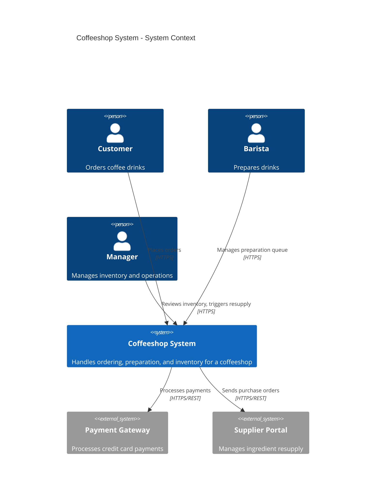

**Derivation**: Every actor comes from the Phase 0 Impact Map. Every external system comes from the Phase 2 Context Map's external relationships.

### Level 2: Container

Shows the deployable units — one service per Bounded Context, plus shared infrastructure.

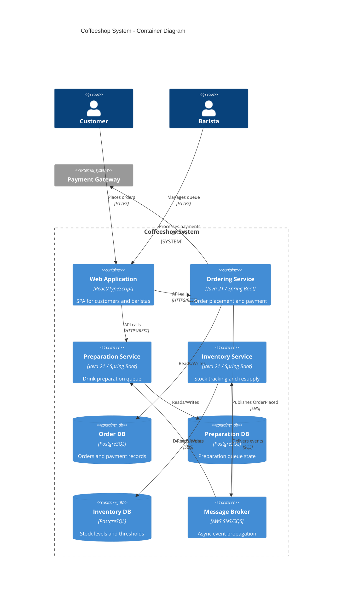

**Derivation**: Each container maps 1:1 to a Bounded Context from Phase 2. Databases are per-BC (no shared database anti-pattern). The message broker comes from Phase 5 infrastructure decisions.

### Level 3: Component (Per BC)

Shows the internal Clean Architecture layers within a single Bounded Context.

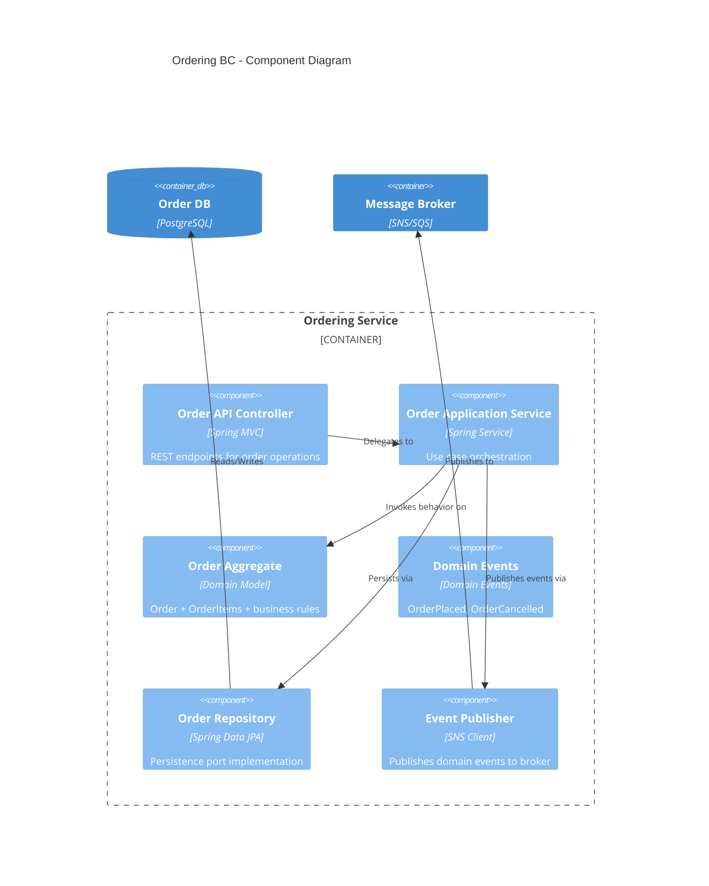

**Derivation**: Components map directly to the Clean Architecture layers defined in Phase 3 Tactical Design. The aggregate name, events, and repository all come from the Phase 3 aggregate catalog.

---

## 2. Domain Model Class Diagrams

One class diagram per Bounded Context, showing aggregates, entities, value objects, and their relationships.

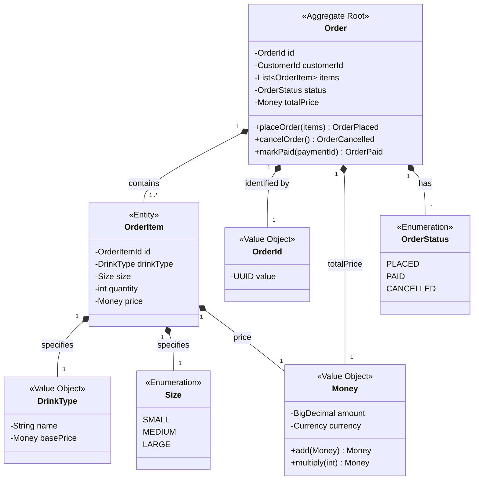

**Key conventions**:
- Stereotypes (`<<Aggregate Root>>`, `<<Entity>>`, `<<Value Object>>`) make DDD building blocks explicit
- Methods on the Aggregate Root return domain events (e.g., `placeOrder(items) OrderPlaced`)
- Value Objects are immutable — no setters, only factory methods
- The aggregate boundary is visible: everything connected to `Order` is inside the consistency boundary

---

## 3. Sequence Diagrams

One sequence diagram per use case or vertical slice. These trace the flow from actor through API to domain and back.

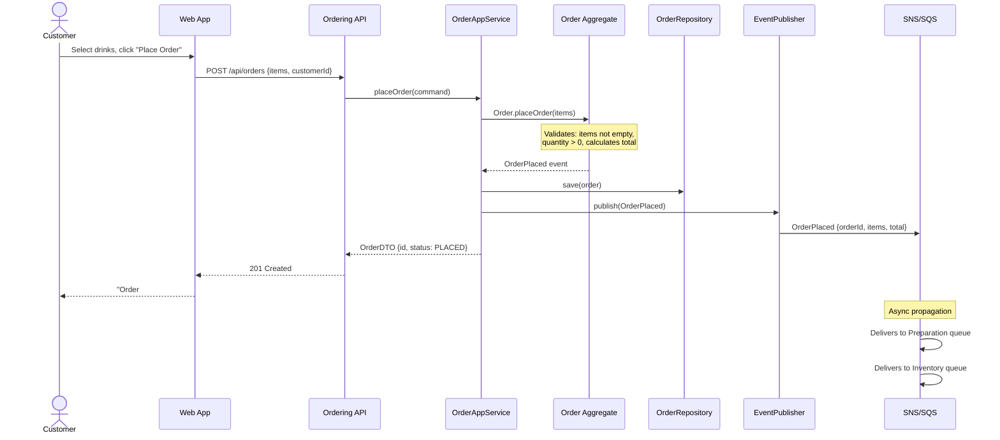

**Derivation**: The vertical flow maps directly to the Phase 1 Event Storming process-level model. The command (`placeOrder`), aggregate (`Order`), and event (`OrderPlaced`) all appear on the event storming board. The API endpoint comes from the Phase 3 API contract.

---


## 4. State Machine Diagrams

One state machine per aggregate. These are among the most critical diagrams in the entire documentation suite.

### The Cardinal Rule: Show WHO Triggers Each Transition

A state diagram without actors is **dangerous**. If you draw `PLACED --> PREPARING` without saying who or what causes that transition, you will discover the gap during implementation — or worse, in production.

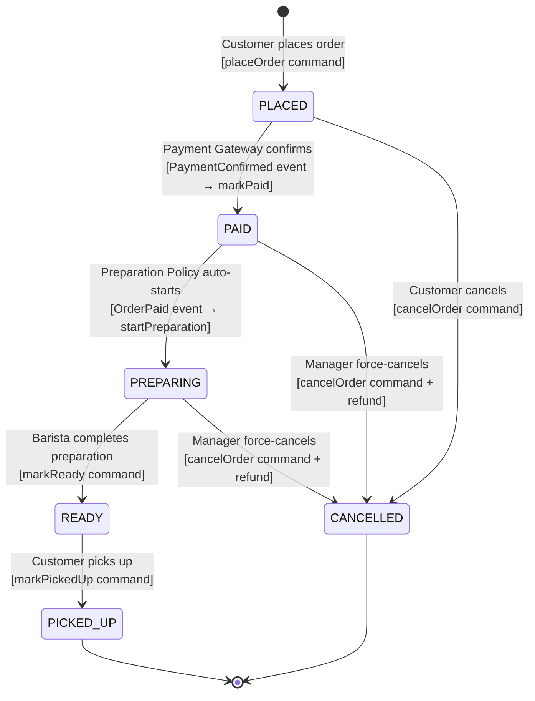

Notice each transition label has three parts:

1. **WHO** triggers it (Customer, Barista, Manager, Payment Gateway, or a Policy)
2. **WHAT** triggers it (command or event name)
3. **HOW** it enters the system (command from UI vs. event from another BC vs. automated policy)

| From | To | Triggered By | Mechanism |
|------|-----|-------------|-----------|
| `[*]` | PLACED | Customer | `placeOrder` command via API |
| PLACED | PAID | Payment Gateway | `PaymentConfirmed` event (async) |
| PLACED | CANCELLED | Customer | `cancelOrder` command via API |
| PAID | PREPARING | Preparation Policy | `OrderPaid` event triggers auto-start |
| PAID | CANCELLED | Manager | `cancelOrder` command (+ refund saga) |
| PREPARING | READY | Barista | `markReady` command via API |
| PREPARING | CANCELLED | Manager | `cancelOrder` command (+ refund saga) |
| READY | PICKED_UP | Customer | `markPickedUp` command via API |

> **Why this matters**: The transition from PAID to PREPARING is **not** triggered by a human. It is an automated policy reacting to the `OrderPaid` event. If the state diagram just showed `PAID --> PREPARING` without annotation, a developer might build a UI button for it — or worse, forget to implement the automation entirely.

---

## 5. Package Diagrams

One per Bounded Context, showing module dependencies and Clean Architecture layer compliance.

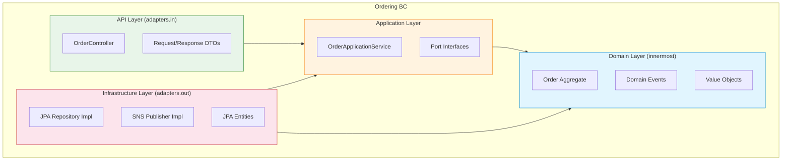

**The Dependency Rule** is visible in the arrows:
- API depends on Application (never on Domain directly)
- Application depends on Domain
- Infrastructure depends on Application and Domain (implements ports)
- **Domain depends on nothing** — it is the innermost layer

Violations of this rule are caught by Phase 6 anti-pattern guard #8 (Dependency Rule Violation).

---

## 6. Activity Diagrams for Sagas and Policies

When an operation spans multiple Bounded Contexts, a saga coordinates the process. Activity diagrams show the happy path and compensation logic.

### Order Cancellation Saga (spans Ordering + Preparation + Inventory)

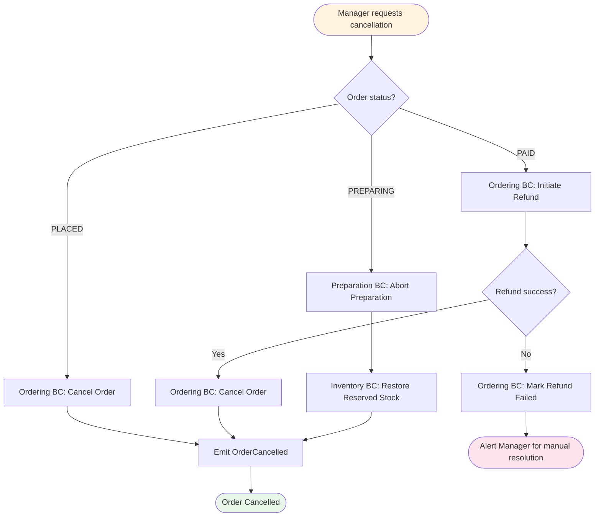

### Event-Sourced Policy: Auto-Reorder on Low Stock

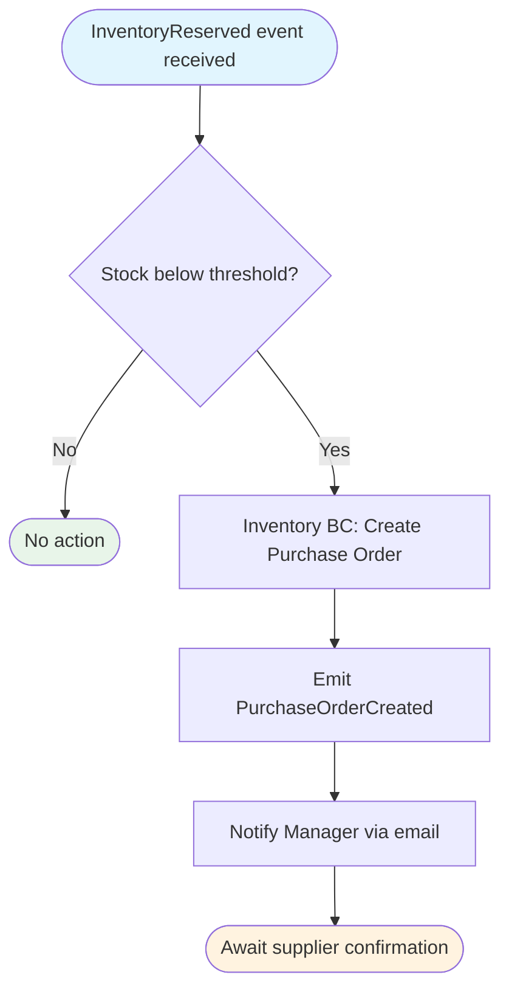

**Derivation**: Every saga comes from Phase 3 tactical design. The compensation paths come from Phase 4 BDD scenarios that test failure modes.

---

## 7. Aggregate Boundary Diagrams

These diagrams make explicit what is **inside** the consistency boundary versus what is **outside** (eventually consistent).

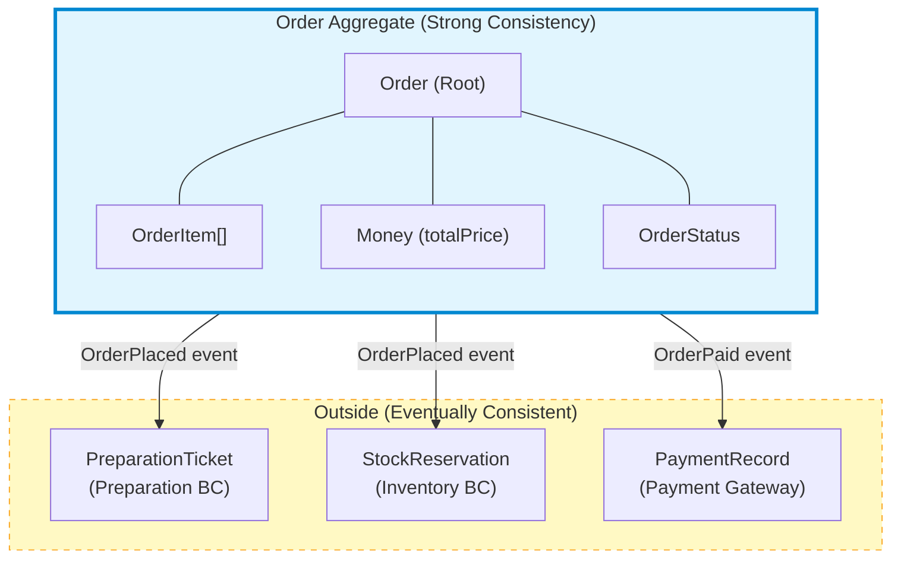

**What this tells developers**:
- Everything inside the blue box is persisted in a **single transaction**
- Everything outside the box is updated **asynchronously via domain events**
- You never update an `Order` and a `PreparationTicket` in the same transaction

---

## 8. Domain Event Flow Diagram

Shows how events propagate across Bounded Context boundaries. This is the "nervous system" of the coffeeshop.

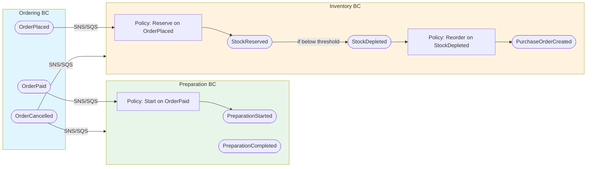

**Derivation**: Every event in this diagram appears in the Phase 1 Event Storming board. Every arrow across a BC boundary corresponds to a relationship in the Phase 2 Context Map. If an event appears in the event storm but not in this diagram, something was lost in translation.

---

## 9. Living Documentation: Not Hand-Drawn, Derived

The diagrams above are not creative works. They are **mechanical transformations** of architecture artifacts:

| Diagram | Derived From | Transformation Rule |
|---------|-------------|-------------------|
| C4 Context | Phase 2 Context Map | Actors become `Person`, BCs become `System`, external deps become `System_Ext` |
| C4 Container | Phase 2 BCs + Phase 5 IaC | Each BC becomes a `Container`, each database becomes `ContainerDb` |
| C4 Component | Phase 3 Clean Architecture | Each layer becomes a `Component`, dependency arrows follow Dependency Rule |
| Domain Model | Phase 3 Aggregate Catalog | Each aggregate/entity/VO becomes a `class` with stereotype |
| Sequence | Phase 1 Event Storm + Phase 4 BDD | Each command-aggregate-event chain becomes a sequence flow |
| State Machine | Phase 3 Aggregate Lifecycle | Each status enum becomes a state, each command/event becomes a transition |
| Package | Phase 3 Module Structure | Each package becomes a subgraph, imports become arrows |
| Activity | Phase 3 Sagas | Each saga step becomes an activity, compensation becomes alt path |
| Event Flow | Phase 1 Events + Phase 2 Context Map | Each cross-BC event becomes an arrow between BC subgraphs |

This is the core insight of Living Documentation: **if the source artifact changes, the diagram changes too.** There is no separate "documentation update" task. The diagrams are projections of the architecture, not independent creations.

---

## Documentation Index

Phase 7 produces a documentation index that links every diagram to its source artifacts and its consumers.

```
.arch/07-documentation/
├── index.md                           # Master index linking everything
├── c4/
│   ├── system-context.md              # Level 1 — one per system
│   ├── container.md                   # Level 2 — one per system
│   ├── ordering-components.md         # Level 3 — one per BC
│   ├── preparation-components.md
│   └── inventory-components.md
├── domain-models/
│   ├── ordering-domain-model.md       # Class diagram per BC
│   ├── preparation-domain-model.md
│   └── inventory-domain-model.md
├── sequences/
│   ├── place-order.md                 # One per use case
│   ├── cancel-order.md
│   ├── prepare-drink.md
│   ├── pick-up-order.md
│   └── restock-inventory.md
├── state-machines/
│   ├── order-lifecycle.md             # One per aggregate
│   ├── preparation-ticket-lifecycle.md
│   └── stock-item-lifecycle.md
├── package-diagrams/
│   ├── ordering-packages.md           # One per BC
│   ├── preparation-packages.md
│   └── inventory-packages.md
├── activity-diagrams/
│   ├── order-cancellation-saga.md     # One per saga
│   └── auto-reorder-policy.md
├── aggregate-boundaries/
│   ├── order-boundary.md              # One per aggregate
│   ├── preparation-ticket-boundary.md
│   └── stock-item-boundary.md
└── event-flows/
    └── cross-bc-event-flow.md         # One per system
```

### The Index File

The `index.md` links every diagram to three things:

1. **Source artifacts** — which Phase 1-6 files were used to derive this diagram
2. **ADR references** — which Architecture Decision Records are relevant
3. **Implementation modules** — which code packages implement this part of the architecture

```markdown
## Order Lifecycle Sequence

- **Diagram**: `sequence/sequence-order-lifecycle.md`
- **Source artifacts**:
  - Phase 1: `.arch/01-discovery/event-storm.yaml` (OrderPlaced, sourced_from DS-01.5)
  - Phase 3: `.arch/03-tactical/aggregates/ordering.yaml`
  - Phase 4: `.arch/04-specification/features/ordering.feature`
- **ADRs**: ADR-001 (Microservices), ADR-002 (SNS/SQS for events)
- **Implementation**: `services/ordering/src/.../application/PlaceOrderUseCase.java`
```

This traceability is what makes documentation **living** rather than **decaying**. When a developer changes the `PlaceOrderUseCase`, they can trace back to the sequence diagram, the BDD scenario, and the event storm — and verify that all still agree.

And in Phase 7 it is not only a convention. `docs-events-match-storm` reads the prose this
phase produced and fails on any event name that no Event Storm event declares. A diagram is
the easiest place in the whole pipeline to invent something plausible — when that sensor was
first widened from "the 07 directory" to "the prose this phase produced", the count of
invented event names in the coffeeshop went from 14 to **44**.

---

## Practical Tips

### Keep Diagrams Focused

Each Mermaid diagram should fit on a single screen. If a C4 Component diagram has 20+ boxes, split it. If a sequence diagram has 15+ participants, extract sub-sequences.

### Use Consistent Color Coding

| Color | Meaning | Hex |
|-------|---------|-----|
| Light blue | Domain layer / Core | `#e1f5fe` |
| Light orange | Application layer | `#fff3e0` |
| Light green | API / Presentation layer | `#e8f5e9` |
| Light red | Infrastructure layer | `#fce4ec` |
| Light yellow | External / Eventually consistent | `#fff9c4` |

### Embed in Code Reviews

When a PR changes aggregate behavior, the reviewer should check the corresponding state machine diagram. When a PR adds a new API endpoint, the reviewer should check the sequence diagram. Living documentation only stays alive if it is part of the development workflow.

---

## Output Summary

Phase 7 produces:

| Artifact | Count (Coffeeshop) | Format |
|----------|-------------------|--------|
| C4 System Context | 1 | Mermaid in Markdown |
| C4 Container | 1 | Mermaid in Markdown |
| C4 Component | 3 (one per BC) | Mermaid in Markdown |
| Domain Model | 3 (one per BC) | Mermaid classDiagram |
| Sequence Diagrams | 5 (one per use case) | Mermaid sequenceDiagram |
| State Machines | 3 (one per aggregate) | Mermaid stateDiagram-v2 |
| Package Diagrams | 3 (one per BC) | Mermaid flowchart |
| Activity Diagrams | 2 (sagas + policies) | Mermaid flowchart |
| Aggregate Boundaries | 3 (one per aggregate) | Mermaid flowchart |
| Event Flow | 1 | Mermaid flowchart |
| Documentation Index | 1 | Markdown with links |
| **Total** | **~26 files** | |

Every diagram is derived. Every diagram traces to source artifacts. Every diagram renders in VS Code, GitHub, and any Markdown viewer.

This is documentation that earns its keep.

---

[← Previous: Phase 6 — Architecture Review](./10-phase-6-review.md) | [Table of Contents](./README.md) | [Next: Phase 8 — Implementation →](./12-phase-8-implementation.md)
