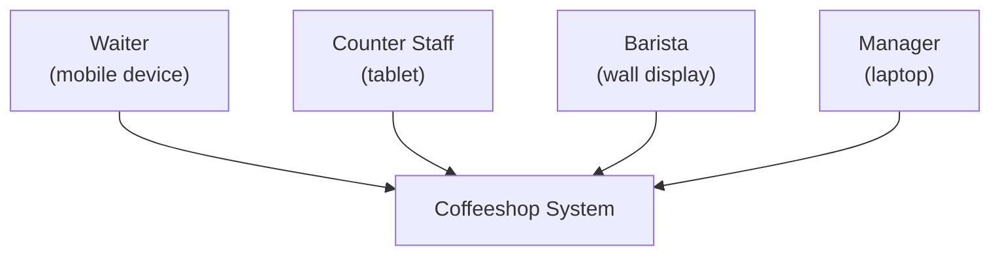
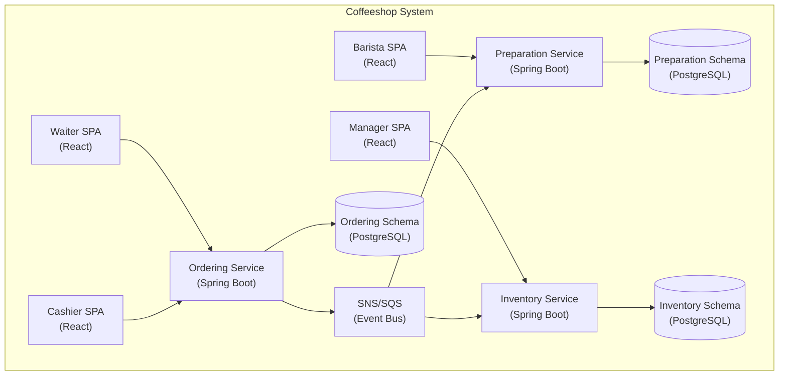

# Chapter 16: Walkthrough — The Coffeeshop


*Photo by [Unsplash](https://unsplash.com) — Free to use under [Unsplash License](https://unsplash.com/license)*

> *"In theory, theory and practice are the same. In practice, they are not."* — Albert Einstein
>
> This chapter closes that gap. One requirements document in, running microservices out.

---

## What You'll See

This chapter walks through every ACG phase using a single concrete example: a small coffee shop in Taipei. No hand-waving, no "imagine this" — every artifact shown here is what the `/architect` skill actually produces.

The goal: take a one-page requirements document and trace it all the way to running code on AWS.

---

## The Requirements Document

```
Coffee Shop — Da'an District, Taipei

Physical Setup:
  - 5 tables, 10 seats total

Staff:
  - Customer, Waiter, Counter Staff (Cashier), Barista

Menu (Cash Only):
  - Espresso: Single $60, Double $80
  - Americano: $80 (Small), $100 (Medium), $120 (Large), $140 (Extra Large)
  - Latte: $100 (Small), $120 (Medium), $140 (Large), $160 (Extra Large)
  - Cappuccino: $100 (Small), $120 (Medium), $140 (Large), $160 (Extra Large)

Customizations:
  - Foam level: Less / Normal / Extra
  - Cappuccino style: Dry / Wet
  - Whipped cream: +$20
  - Soy milk substitution (no surcharge)

Order Workflow:
  1. Waiter takes order at table
  2. Counter staff confirms the order
  3. Customer pays in cash at counter
  4. Barista prepares coffee
  5. Waiter delivers to table

Inventory:
  - Track: coffee beans, milk, soy milk, filter paper
  - Alert when stock drops below 30%
  - Replenishment SLA: 3 business days
```

That's it. One page. Let's run the pipeline.

---

## Phase 0: Requirements

Phase 0 transforms raw requirements into structured planning artifacts.

### Impact Map

```
Goal: Streamline order-to-serve workflow
│
├── Customer
│   ├── Impact: Faster service, fewer order errors
│   └── Deliverable: Digital order tracking per table
│
├── Waiter
│   ├── Impact: Reduce trips between table and counter
│   └── Deliverable: Mobile order entry interface
│
├── Counter Staff (Cashier)
│   ├── Impact: Accurate billing, faster payment
│   └── Deliverable: Order confirmation + cash payment screen
│
├── Barista
│   ├── Impact: Clear preparation queue, no verbal miscommunication
│   └── Deliverable: Preparation dashboard with order details
│
└── Manager (implied)
    ├── Impact: Prevent stock-outs, operational visibility
    └── Deliverable: Inventory monitoring dashboard
```

### Story Map

```
Backbone (Walking Skeleton):

Place Order → Confirm Order → Pay → Prepare Coffee → Deliver → Manage Inventory
    │              │           │         │             │            │
    ▼              ▼           ▼         ▼             ▼            ▼
 Waiter        Counter     Counter   Barista       Waiter      Manager
 selects       reviews     accepts   starts        picks up    views
 table +       items +     cash      preparation   completed   stock
 items         confirms    payment   + marks done   coffee     levels
```

### Glossary Seeding

The Ubiquitous Language is seeded from the requirements:

```yaml
glossary:
  - term: OrderType
    definition: "DINE_IN (only type for this shop — all tables)"
  - term: CupSize
    values: [SMALL, MEDIUM, LARGE, EXTRA_LARGE]
    note: "Espresso uses Single/Double instead"
  - term: CoffeeType
    values: [ESPRESSO, AMERICANO, LATTE, CAPPUCCINO]
  - term: TableNumber
    type: "Value Object, integer 1-5"
  - term: FoamLevel
    values: [LESS, NORMAL, EXTRA]
  - term: CappuccinoStyle
    values: [DRY, WET]
  - term: MilkType
    values: [REGULAR, SOY]
  - term: Money
    definition: "Amount in TWD (New Taiwan Dollar), integer, no decimals"
```

---

## Phase 1: Discovery

### Event Storming

The Event Storm surfaces ~15 domain events across the workflow:

```
Timeline ──────────────────────────────────────────────────────────►

 🟧 OrderPlaced          🟧 PaymentReceived          🟧 CoffeePrepared
      │                       │                            │
 🟧 OrderConfirmed       🟧 OrderSubmittedToBarista   🟧 CoffeeDelivered
      │                       │                            │
      │                  🟧 CoffeePreparationStarted  🟧 OrderCompleted
      │
      │                  🟧 StockLevelDropped
      │                  🟧 LowStockAlertTriggered
      │                  🟧 ReplenishmentRequested
      │                  🟧 ReplenishmentReceived
      │                  🟧 StockReplenished
```

### Bounded Context Candidates

Three clusters emerge naturally from the event timeline:

| Bounded Context | Events | Key Actors |
|---|---|---|
| **Ordering** | OrderPlaced, OrderConfirmed, PaymentReceived, OrderCompleted | Waiter, Counter Staff, Customer |
| **Preparation** | OrderSubmittedToBarista, CoffeePreparationStarted, CoffeePrepared, CoffeeDelivered | Barista, Waiter |
| **Inventory** | StockLevelDropped, LowStockAlertTriggered, ReplenishmentRequested, ReplenishmentReceived, StockReplenished | Manager |

### Cross-BC Events

These events cross Bounded Context boundaries and define the integration contracts:

```
Ordering ──OrderSubmittedToBarista──► Preparation
Preparation ──CoffeePrepared──► Ordering (triggers delivery flow)
Preparation ──StockLevelDropped──► Inventory (ingredient consumption)
```

---

## Assessment Gate: Architecture Decisions

The pipeline pauses. The human answers six questions:

```
┌─────────────────────────────────────────────────────────┐
│  Assessment Gate: Architecture Decisions                │
│                                                         │
│  Q1. Architecture style?                                │
│      ► (B) Microservices — one service per BC           │
│                                                         │
│  Q2. Team size?                                         │
│      ► (B) Small team: 4-6 engineers                    │
│                                                         │
│  Q3. Messaging infrastructure?                          │
│      ► SNS/SQS (AWS native, no Kafka overhead)          │
│                                                         │
│  Q4. Data architecture?                                 │
│      ► Schema-per-BC (single RDS, isolated schemas)     │
│                                                         │
│  Q5. Compute platform?                                  │
│      ► EKS (Kubernetes)                                 │
│                                                         │
│  Q6. AWS Region?                                        │
│      ► ap-east-2 (Taipei — closest to customers)        │
│                                                         │
└─────────────────────────────────────────────────────────┘
```

These decisions are recorded in `assessment-1.md` and constrain every subsequent phase.

---

## Phase 2: Strategic Design

### Subdomain Classification

| BC | Classification | Rationale |
|---|---|---|
| **Ordering** | Core | Revenue-generating. Every dollar flows through here. Contains pricing logic, payment processing, the customer-facing workflow. |
| **Preparation** | Supporting | Differentiating but not revenue-critical. Manages the barista queue and delivery tracking. |
| **Inventory** | Generic | Standard stock management. Could be replaced by an off-the-shelf tool. |

### Context Map

```
┌──────────────┐    Customer-Supplier    ┌──────────────────┐
│              │ ─────────────────────── │                  │
│   Ordering   │   (upstream/downstream) │   Preparation    │
│    (Core)    │ ◄────────────────────── │   (Supporting)   │
│              │                         │                  │
└──────────────┘                         └────────┬─────────┘
                                                  │
                                                  │ Conformist
                                                  │ (downstream)
                                                  ▼
                                         ┌──────────────────┐
                                         │                  │
                                         │    Inventory     │
                                         │    (Generic)     │
                                         │                  │
                                         └──────────────────┘
```

**Ordering → Preparation**: Customer-Supplier. Ordering publishes `OrderSubmittedToBarista`; Preparation subscribes. Ordering defines the contract; Preparation conforms.

**Preparation → Inventory**: Conformist. Preparation emits `StockLevelDropped` when ingredients are consumed. Inventory conforms to whatever Preparation publishes.

---


## Phase 3: Tactical Design

### Order Aggregate — Vernon's Four Rules Applied

**Rule 1: Model True Invariants**

The Order aggregate groups only what must be atomically consistent:

```
┌─────────────────────────────────────────────────────────┐
│  Order Aggregate (consistency boundary)                 │
│                                                         │
│  Order (Root Entity)                                    │
│     ├── UUID id                                         │
│     ├── TableNumber tableNumber       (VO, 1-5)        │
│     ├── OrderType orderType           (DINE_IN)        │
│     ├── OrderStatus status            (state machine)  │
│     ├── Money totalAmount             (VO, TWD)        │
│     ├── Money cashReceived            (VO, TWD)        │
│     ├── Money changeAmount            (VO, TWD)        │
│     └── List<OrderItem> items                           │
│            ├── CoffeeType coffeeType                    │
│            ├── CupSize cupSize                          │
│            ├── FoamLevel foamLevel                      │
│            ├── CappuccinoStyle cappuccinoStyle          │
│            ├── boolean whippedCream                     │
│            ├── MilkType milkType                        │
│            └── Money unitPrice                          │
│                                                         │
│  Invariants:                                            │
│  • items.size() >= 1                                    │
│  • tableNumber in [1..5]                                │
│  • cashReceived >= totalAmount (on payment)             │
│  • Status follows: PLACED→CONFIRMED→PAID→PREPARING     │
│    →PREPARED→DELIVERED→COMPLETED                        │
└─────────────────────────────────────────────────────────┘
```

**Rule 2: Design Small Aggregates** — Order contains only its items as Value Objects. No nested entities.

**Rule 3: Reference by Identity** — Preparation references `orderId`, not the Order object.

**Rule 4: Eventual Consistency** — When an order is paid, a `PaymentReceived` event is published. Preparation subscribes and creates its own `PreparationTask` aggregate.

### Task-Based API (Not CRUD)

Every endpoint corresponds to a domain command, not a database operation:

```yaml
api-contracts:
  ordering:
    - POST   /api/waiter/orders                    # PlaceOrder
    - POST   /api/cashier/orders/{id}/confirm      # ConfirmOrder
    - POST   /api/cashier/orders/{id}/pay          # ProcessPayment
    - GET    /api/waiter/orders?status=PREPARED     # FindPreparedOrders
    - POST   /api/waiter/orders/{id}/deliver       # MarkDelivered

  preparation:
    - GET    /api/barista/tasks?status=PENDING      # ViewPreparationQueue
    - POST   /api/barista/tasks/{id}/start          # StartPreparation
    - POST   /api/barista/tasks/{id}/complete       # MarkPrepared

  inventory:
    - GET    /api/manager/inventory                 # ViewStockLevels
    - POST   /api/manager/inventory/{id}/replenish  # RecordReplenishment
```

Notice: no `PUT /api/orders/{id}`. No generic update. Each endpoint is a **task** that a specific **actor** performs.

### Actor Views

```yaml
actor-views:
  waiter:
    - page: WaiterOrderPage
      purpose: "Place new orders and view table status"
      data: [tables, activeOrders, menu]
    - page: WaiterDeliveryPage
      purpose: "View prepared orders ready for delivery"
      data: [preparedOrders]

  cashier:
    - page: CashierOrderPage
      purpose: "Confirm orders and process cash payment"
      data: [pendingOrders, orderDetails, paymentCalculation]

  barista:
    - page: BaristaPreparationPage
      purpose: "View preparation queue and mark completion"
      data: [preparationQueue, currentTask]

  manager:
    - page: ManagerInventoryPage
      purpose: "Monitor stock levels and record replenishment"
      data: [stockLevels, lowStockAlerts, replenishmentHistory]
```

---

## Phase 3c: UX Design

### Status-to-Color Mapping

Derived from the domain model's `OrderStatus` enum:

| Status | Color | Hex | Rationale |
|---|---|---|---|
| PLACED | Blue | `#3B82F6` | New, needs attention |
| CONFIRMED | Indigo | `#6366F1` | Progressing |
| PAID | Green | `#22C55E` | Money received, ready to prepare |
| PREPARING | Amber | `#F59E0B` | In progress |
| PREPARED | Teal | `#14B8A6` | Ready for pickup |
| DELIVERED | Slate | `#64748B` | En route to table |
| COMPLETED | Gray | `#9CA3AF` | Done, archival |

### Per-Actor Overrides

```yaml
actor-overrides:
  barista:
    touch-target-min: 48px       # Larger — wet/floury hands
    font-size-base: 18px         # Readable from arm's length
    layout: single-column        # Focus on one order at a time

  cashier:
    number-display: extra-large  # Payment amounts must be unmistakable
    calculator-style: true       # Cash input mimics register layout

  manager:
    layout: dense-table          # Many rows, compact spacing
    chart-type: sparkline        # Trend-at-a-glance for stock levels
```

---

## Phase 4: Specification

### BDD Scenarios

Prices come directly from the requirements — not invented, not rounded:

```gherkin
Feature: Order Payment
  As counter staff I want to process cash payment
  So that paid orders are submitted to the barista

  Rule: Cash must cover the order total

    Scenario: Pay for two lattes with exact change
      Given an order with the following items:
        | Coffee   | Size   | Price |
        | Latte    | Medium | $120  |
        | Latte    | Large  | $140  |
      And the order total is $260
      And the order is in CONFIRMED status
      When counter staff processes payment of $260
      Then the order status should be PAID
      And the change amount should be $0
      And a PaymentReceived event should be published

    Scenario: Pay with excess cash
      Given an order with total $180
      And the order is in CONFIRMED status
      When counter staff processes payment of $200
      Then the change amount should be $20

    Scenario: Whipped cream adds to price
      Given an order with the following items:
        | Coffee      | Size  | Whipped Cream | Price |
        | Cappuccino  | Small | Yes           | $120  |
      And the order total is $120
      When counter staff processes payment of $120
      Then the order status should be PAID
```

Note: Cappuccino Small is $100 + $20 whipped cream = $120. The scenario encodes the exact pricing rule.

### Frontend Resilience Scenarios

```gherkin
Feature: Barista Page Resilience
  As a barista I need the preparation page to work
  even when the backend is temporarily unavailable

  Scenario: Show stale data with warning on API timeout
    Given the barista preparation page is loaded
    And 3 tasks are displayed
    When the next poll to /api/barista/tasks times out
    Then the page should display the 3 previously loaded tasks
    And a "Connection lost — showing last known state" banner should appear

  Scenario: Optimistic start with rollback
    Given a pending task "TASK-42" is displayed
    When the barista taps "Start Preparation"
    Then the task should immediately show PREPARING status
    When the POST to /api/barista/tasks/TASK-42/start fails
    Then the task should revert to PENDING status
    And a "Failed to start — please try again" toast should appear
```

### STRIDE Threat Model (Ordering BC)

| Threat | Category | Mitigation |
|---|---|---|
| Waiter modifies prices in request | Tampering | Server-side price lookup from menu catalog; ignore client-sent prices |
| Replay of PaymentReceived event | Spoofing | Idempotency key on event; deduplication at SQS consumer |
| Barista accesses payment details | Information Disclosure | Preparation BC receives only orderId + items, never payment amounts |
| DDoS on order placement | Denial of Service | Rate limiting per API key; WAF rules |
| Staff bypasses payment step | Elevation of Privilege | State machine enforces CONFIRMED → PAID; cannot skip to PREPARING |

---

## Phase 5: Delivery

### 7-Stage Pipeline

```
Commit → Integration → Acceptance → Visual → Contract → Perf → Production
(10min)   (5min)       (15min)      (5min)   (5min)     (10min)  (canary)
```

Ordering BC uses **Canary deployment** (Core). Preparation uses **Blue-Green** (Supporting). Inventory uses **Rolling** (Generic).

### CDK Stacks

```
iac/
├── bin/
│   └── coffeeshop-app.ts
├── lib/
│   ├── network-stack.ts         # VPC, subnets, NAT, security groups
│   ├── data-stack.ts            # RDS PostgreSQL, 3 schemas (ordering/preparation/inventory)
│   ├── messaging-stack.ts       # SNS topics: ordering-events, preparation-events
│   │                            # SQS queues: preparation-from-ordering, inventory-from-preparation
│   │                            # DLQs per queue
│   ├── compute-stack.ts         # EKS cluster, 3 deployments, HPA per BC
│   ├── frontend-stack.ts        # S3 + CloudFront, 4 actor-specific SPAs
│   └── observability-stack.ts   # CloudWatch dashboards, X-Ray tracing, SNS alarms
└── cdk.json
```

Every stack traces back to architecture artifacts: `messaging-stack.ts` is derived from `context-map.yaml`; `data-stack.ts` from `bounded-contexts.yaml` + the schema-per-BC assessment decision.

---

## Phase 6: Review

### 7 Viewpoints

| Viewpoint | Key Finding |
|---|---|
| **Functional** | 3 BCs, 3 aggregates (Order, PreparationTask, StockItem), 15 domain events |
| **Information** | Schema-per-BC isolation. No cross-schema joins. Event-carried state transfer for reads. |
| **Concurrency** | Order state machine prevents race conditions. SQS FIFO for ordered event processing. |
| **Development** | Mono-repo with 3 service modules. Each BC independently deployable. |
| **Deployment** | EKS with 3 namespaces. Canary for Ordering, Blue-Green for Preparation, Rolling for Inventory. |
| **Operational** | CloudWatch dashboards per BC. X-Ray traces span across SNS/SQS boundaries. |
| **Context** | Small team (4-6). ap-east-2 single-region. Cash-only simplifies payment compliance. |

### 10 Perspectives

| Perspective | Status | Notes |
|---|---|---|
| Security | PASS | STRIDE mitigations applied. No PII stored (cash-only, no customer accounts). |
| Performance | PASS | <200ms P99 for order placement. HPA scales barista queue consumers. |
| Availability | PASS | Multi-AZ RDS. SQS provides buffer during service restarts. |
| Evolution | PASS | Adding a new BC (e.g., Loyalty) requires only a new SNS subscription. |
| Accessibility | PASS | WCAG 2.1 AA. Barista UI meets large-target requirements. |
| Internationalization | WARN | Currently TWD-only. Money VO supports multi-currency but no locale switching yet. |
| Regulation | PASS | No personal data. Cash transactions. Minimal compliance surface. |
| Usability | PASS | Per-actor UX overrides. Touch-optimized for barista. |
| Scalability | PASS | Horizontal scaling via EKS HPA. SQS absorbs burst orders. |
| Resilience | PASS | Optimistic UI with rollback. Stale-data banners. DLQs for poison messages. |

### Anti-Pattern Check

```
✅ No Anemic Domain Model    — Order has behavior methods (confirm, pay, deliver)
✅ No CRUD API                — All endpoints are task-based commands
✅ No God Aggregate           — Order is small (root + value objects only)
✅ No Shared Database         — Schema-per-BC, no cross-schema access
✅ No Sync Cross-BC Calls     — All integration via SNS/SQS events
✅ No Missing Invariant       — All business rules encoded in aggregate
✅ No Orphan Event            — Every event has at least one subscriber
```

---

## Phase 7: Documentation

### C4 Diagrams (Mermaid)

**System Context:**



**Container Diagram:**



### Order State Machine

```
PLACED ──confirm()──► CONFIRMED ──pay()──► PAID ──submitToBarista()──► PREPARING
                                                                          │
    COMPLETED ◄──complete()── DELIVERED ◄──deliver()── PREPARED ◄──markPrepared()──┘
```

---

## Assessment Gate: Technology Stack

The pipeline pauses again before implementation:

```
┌─────────────────────────────────────────────────────────┐
│  Assessment Gate: Technology Stack                      │
│                                                         │
│  Backend:   Java 21, Spring Boot 4.x                    │
│  Database:  PostgreSQL 16                               │
│  Frontend:  React 19 + TypeScript 5.x                   │
│  Styling:   Tailwind CSS 4 + shadcn/ui                  │
│  Testing:   JUnit 5, Cucumber, Playwright, MSW          │
│  IaC:       AWS CDK (TypeScript)                        │
│                                                         │
└─────────────────────────────────────────────────────────┘
```

---


## Phase 8: Implementation

Now every line of code is constrained by **all** previous artifacts.

### Money Value Object

Constrained by: glossary (`Money: TWD, integer`), pricing table from requirements.

```java
public record Money(int amount) {

    public Money {
        if (amount < 0) {
            throw new IllegalArgumentException("Money cannot be negative: " + amount);
        }
    }

    public static final Money ZERO = new Money(0);

    public Money add(Money other) {
        return new Money(this.amount + other.amount);
    }

    public Money subtract(Money other) {
        return new Money(this.amount - other.amount);
    }

    public boolean isGreaterThanOrEqual(Money other) {
        return this.amount >= other.amount;
    }
}
```

### CoffeeType — Behavior Enum

Constrained by: glossary, pricing table, Vernon's "push behavior into Value Objects" guidance.

```java
public enum CoffeeType {
    ESPRESSO {
        @Override
        public Money priceFor(CupSize size) {
            return switch (size) {
                case SINGLE -> new Money(60);
                case DOUBLE -> new Money(80);
                default -> throw new IllegalArgumentException(
                    "Espresso only supports SINGLE and DOUBLE");
            };
        }
    },
    AMERICANO {
        @Override
        public Money priceFor(CupSize size) {
            return switch (size) {
                case SMALL -> new Money(80);
                case MEDIUM -> new Money(100);
                case LARGE -> new Money(120);
                case EXTRA_LARGE -> new Money(140);
                default -> throw new IllegalArgumentException("Invalid size for Americano");
            };
        }
    },
    LATTE {
        @Override
        public Money priceFor(CupSize size) {
            return switch (size) {
                case SMALL -> new Money(100);
                case MEDIUM -> new Money(120);
                case LARGE -> new Money(140);
                case EXTRA_LARGE -> new Money(160);
                default -> throw new IllegalArgumentException("Invalid size for Latte");
            };
        }
    },
    CAPPUCCINO {
        @Override
        public Money priceFor(CupSize size) {
            return switch (size) {
                case SMALL -> new Money(100);
                case MEDIUM -> new Money(120);
                case LARGE -> new Money(140);
                case EXTRA_LARGE -> new Money(160);
                default -> throw new IllegalArgumentException("Invalid size for Cappuccino");
            };
        }
    };

    public abstract Money priceFor(CupSize size);
}
```

Every price literal in this enum traces back to the requirements document. Not $99, not $150 — exactly $60, $80, $100, $120, $140, $160.

### Order Entity — pay() Method

Constrained by: aggregate invariants, state machine, BDD scenarios.

```java
public PaymentReceived pay(Money cashReceived) {
    if (this.status != OrderStatus.CONFIRMED) {
        throw new IllegalStateException(
            "Cannot pay order in status: " + this.status);
    }
    if (!cashReceived.isGreaterThanOrEqual(this.totalAmount)) {
        throw new InsufficientPaymentException(this.totalAmount, cashReceived);
    }

    this.cashReceived = cashReceived;
    this.changeAmount = cashReceived.subtract(this.totalAmount);
    this.status = OrderStatus.PAID;

    return new PaymentReceived(this.id, this.totalAmount, cashReceived, this.changeAmount);
}
```

This method encodes:
- **State machine**: must be CONFIRMED (from Phase 7 state diagram)
- **Invariant**: cash >= total (from Phase 3 aggregate design)
- **Domain event**: returns `PaymentReceived` (from Phase 1 Event Storm)
- **Money VO**: no raw integers (from Phase 3 tactical design)

### Outside-In TDD

The BDD scenario drives the implementation from the outside in:

```
Acceptance Test (Gherkin)        ← Phase 4 BDD scenario
    └── Controller Test          ← Phase 3 API contract
        └── Application Service  ← Phase 3 Clean Architecture
            └── Domain Test      ← Phase 3 aggregate invariants
                └── Order.pay()  ← Implementation
```

Each layer is constrained by a different artifact. The developer (or the AI) doesn't decide what to test — the specification already defines it.

---

## The Complete `.arch/` Directory

After all 8 phases, the `.arch/` directory contains every artifact produced:

```
.arch/
├── assessment-1.md                          # Architecture decisions (microservices, SNS/SQS, etc.)
├── assessment-2.md                          # Technology stack (Java 21, React, etc.)
├── glossary.yaml                            # Ubiquitous Language (34 terms)
│
├── 00-requirements/
│   ├── impact-map.yaml                      # Goal → Actors → Impacts → Deliverables
│   └── story-map.yaml                       # Backbone + walking skeleton
│
├── 01-discovery/
│   ├── domain-stories/
│   │   ├── waiter-takes-order.yaml
│   │   ├── cashier-processes-payment.yaml
│   │   ├── barista-prepares-coffee.yaml
│   │   └── manager-checks-inventory.yaml
│   ├── event-storm.yaml                     # 15 events, 8 commands, 4 actors
│   └── event-model.yaml                     # Commands, Views, GWT specs
│
├── 02-strategic/
│   ├── bounded-contexts.yaml                # 3 BCs: Ordering, Preparation, Inventory
│   ├── context-map.yaml                     # Customer-Supplier, Conformist
│   └── subdomain-classification.yaml        # Core, Supporting, Generic
│
├── 03-tactical/
│   ├── aggregates/
│   │   ├── ordering/
│   │   │   └── order-aggregate.yaml         # Vernon's Four Rules applied
│   │   ├── preparation/
│   │   │   └── preparation-task-aggregate.yaml
│   │   └── inventory/
│   │       └── stock-item-aggregate.yaml
│   ├── domain-model.yaml                    # Entities, VOs, Enums, Relationships
│   ├── api-contracts.yaml                   # Task-based endpoints per BC
│   └── frontend-architecture.yaml           # Actor views, data requirements
│
├── 03c-ux-design/
│   └── ux-design-report.yaml                # Status colors, actor overrides, tokens
│
├── 04-specification/
│   ├── features/
│   │   ├── ordering/
│   │   │   ├── place-order.feature
│   │   │   ├── confirm-order.feature
│   │   │   └── order-payment.feature
│   │   ├── preparation/
│   │   │   ├── preparation-queue.feature
│   │   │   └── preparation-workflow.feature
│   │   └── inventory/
│   │       ├── stock-monitoring.feature
│   │       └── replenishment.feature
│   ├── frontend-features/
│   │   ├── barista-resilience.feature
│   │   └── waiter-offline.feature
│   ├── threat-model.yaml                    # STRIDE per BC
│   ├── contract-tests.yaml                  # Pact contracts for cross-BC events
│   └── test-strategy.yaml                   # Test shape per BC
│
├── 05-delivery/
│   ├── pipeline.yaml                        # 7-stage pipeline definition
│   ├── deployment-strategy.yaml             # Canary/Blue-Green/Rolling per BC
│   ├── infrastructure-resource-plan.yaml    # CDK stack → resource mapping
│   ├── observability.yaml                   # Dashboards, traces, alerts
│   └── sli-slo.yaml                         # Error budgets, burn rates
│
├── 06-review/
│   ├── viewpoints/
│   │   ├── functional-viewpoint.md
│   │   ├── information-viewpoint.md
│   │   ├── concurrency-viewpoint.md
│   │   ├── development-viewpoint.md
│   │   ├── deployment-viewpoint.md
│   │   ├── operational-viewpoint.md
│   │   └── context-viewpoint.md
│   ├── perspectives/
│   │   ├── security-perspective.md
│   │   ├── performance-perspective.md
│   │   └── ... (8 more)
│   ├── anti-pattern-report.md               # 7/7 checks passed
│   └── adrs/
│       ├── adr-001-microservices.md
│       ├── adr-002-schema-per-bc.md
│       ├── adr-003-sns-sqs.md
│       └── adr-004-cash-only-no-pci.md
│
└── 07-documentation/
    ├── c4-system-context.md                 # Mermaid diagrams
    ├── c4-container.md
    ├── c4-component-ordering.md
    ├── c4-component-preparation.md
    ├── c4-component-inventory.md
    ├── domain-model.md
    ├── sequence-diagrams/
    │   ├── place-order-sequence.md
    │   ├── payment-sequence.md
    │   └── preparation-sequence.md
    └── state-machines/
        ├── order-state-machine.md
        ├── preparation-task-state-machine.md
        └── stock-item-state-machine.md
```

60+ artifacts. Every one is machine-readable. Every one constrains what comes after it.

---

## The Constraint Chain in Action

Here's how a single business rule — "Cappuccino Small with whipped cream costs $120" — flows through the entire pipeline:

```
Requirements doc          →  "Cappuccino: $100 (Small), whipped cream: +$20"
Phase 0 glossary          →  CoffeeType: CAPPUCCINO, Money: TWD integer
Phase 1 Event Storm       →  Command: PlaceOrder, Event: OrderPlaced
Phase 2 Strategic Design  →  Ordering BC (Core)
Phase 3 Aggregate         →  Order.addItem() calculates price via CoffeeType.priceFor()
Phase 3 API               →  POST /api/waiter/orders { items: [...] }
Phase 4 BDD               →  "Whipped cream adds to price" scenario ($120)
Phase 5 Pipeline          →  Acceptance test runs this Gherkin scenario
Phase 6 Review            →  Anti-pattern check: pricing in domain, not controller ✅
Phase 7 Docs              →  Domain model shows CoffeeType behavior enum
Phase 8 Code              →  CAPPUCCINO.priceFor(SMALL) returns Money(100)
                              + whippedCream surcharge Money(20) = Money(120)
```

Nine phases. One rule. Zero ambiguity.

---

## Key Takeaway

The coffeeshop is deliberately small — 5 tables, 4 coffee types, 3 Bounded Contexts. But the pipeline that processes it is the same one that handles a 50-microservice enterprise system. The methodology scales because each phase is independent: a larger system simply produces more artifacts per phase, not more phases.

What makes the coffeeshop walkthrough valuable is not the coffee — it's watching every constraint tighten, phase by phase, until the only code that can emerge is the **correct** code.

---

[← Previous: Assessment Gates](./15-assessment-gates.md) | [Table of Contents](./README.md) | [Next: Getting Started →](./17-getting-started.md)
